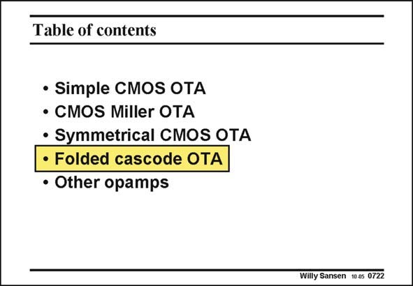

# SANSEN-0722 · Table of contents

章节：07 常用运算放大器电路  
PDF 页：216；书本页：221；幻灯片编号：0722  
状态：unreviewed



## 对应教材讲解

### PDF 216 · 书本 221

The other ‘‘most used’’ operational transconductance amplifier is the folded cascode OTA. Many designers limit themselves to folded cascode OTA’s only. It is therefore important to figure out what exactly the advantages and disadvantages are. Also, which design plan delivers the best performance in terms of power consumption, noise, etc.

## 公式／性能结论候选摘录

以下为规则截取的原文，尚未逐项判读。

- PDF 216: Many designers limit themselves to folded cascode OTA’s only.
- PDF 216: It is therefore important to figure out what exactly the advantages and disadvantages are.

## 曲线结论候选摘录

以下为规则截取的原文，尚未逐项判读。

（未由规则找到；不代表原页没有此类内容。）

## 原文条件与近似候选摘录

以下为规则截取的原文，尚未逐项判读。

（未由规则找到；不代表原页没有此类内容。）

## 幻灯片 OCR（未校正）

```text
Table of contents
• Simple CMOS OTA
• CMOS Miller OTA
• Symmetrical CMOS OTA
• Folded cascode OTA
• Other opamps
Willy Sansen 100s 0722
```

数学上下标、分数及正负号以原图为准。电路图已保留；未核对的连接不输出成可仿真 netlist。
