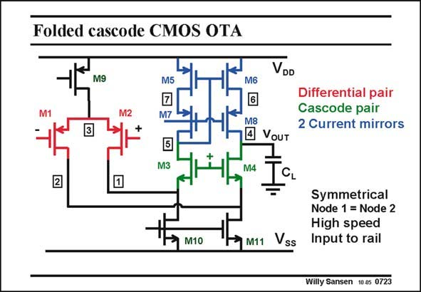

# SANSEN-0723 · Folded cascode CMOS OTA

章节：07 常用运算放大器电路  
PDF 页：217；书本页：222；幻灯片编号：0723  
状态：unreviewed



## 对应教材讲解

### PDF 216 · 书本 221

A folded cascode OTA consists of an input differential pair, two cascodes and one current mirror. The latter current mirror will not be necessary when we have two outputs, as explained in the next Chapter.

### PDF 217 · 书本 222

It is a high-swing current mirror again. This circuit is as symmetrical as the symmetrical OTA as both input devices see exactly the same DC voltage and impedance, at nodes 1 and 2. The output is again the only point at high resistance. Indeed all other nodes are at 1/g level. It is m again a single-stage amplifier, despite its complexity.

## 公式／性能结论候选摘录

以下为规则截取的原文，尚未逐项判读。

（未由规则找到；不代表原页没有此类内容。）

## 曲线结论候选摘录

以下为规则截取的原文，尚未逐项判读。

（未由规则找到；不代表原页没有此类内容。）

## 原文条件与近似候选摘录

以下为规则截取的原文，尚未逐项判读。

（未由规则找到；不代表原页没有此类内容。）

## 幻灯片 OCR（未校正）

```text
Folded cascode CMOS OTA
M9
VDD
M5
M6
M7
Differential pair
Cascode pair
2 Current mirrors
M3
M8
4 VouT
M4
2
M10
M11
Vss
Symmetrical
Node 1 = Node 2
High speed
Input to rail
Willy Sansen 10.05 0723
```

数学上下标、分数及正负号以原图为准。电路图已保留；未核对的连接不输出成可仿真 netlist。
