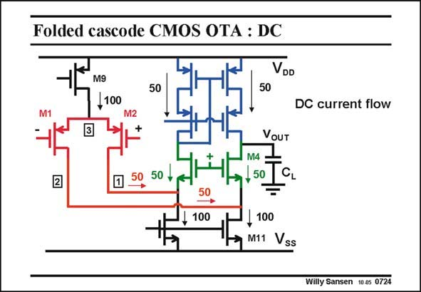

# SANSEN-0724 · Folded cascode CMOS OTA : DC

章节：07 常用运算放大器电路  
PDF 页：217；书本页：222；幻灯片编号：0724  
状态：unreviewed



## 对应教材讲解

### PDF 217 · 书本 222

Let us first examine how the DC operation actually works. The input devices are biased by a current source (with M9) at for example 100 mA. Both input devices carry 50 mA. At node 2, transistor M11 draws 100 mA. The difference between this current and what is coming from M1, is then pulled from cascode transistor M4. This current flows through both cascode transistors. The current source on top mirrors this current. There is no way that DC current could flow out, even if the output node would be connected to ground. Normally, all currents in the input and cascode devices are the same, i.e. 50 mA. This is not a necessity but is certainly the best way to avoid all kinds of artifacts, such as asymmetrical swing, Slew-Rate, etc.

## 公式／性能结论候选摘录

以下为规则截取的原文，尚未逐项判读。

（未由规则找到；不代表原页没有此类内容。）

## 曲线结论候选摘录

以下为规则截取的原文，尚未逐项判读。

（未由规则找到；不代表原页没有此类内容。）

## 原文条件与近似候选摘录

以下为规则截取的原文，尚未逐项判读。

（未由规则找到；不代表原页没有此类内容。）

## 幻灯片 OCR（未校正）

```text
Folded cascode CMOS OTA : DC
VDD
M9
,100
M2
50
50
DC current flow
2
50 +
VoUT
M4
,50 C
100
,100
M11 Vss
Willy Sansen 10.05 0724
```

数学上下标、分数及正负号以原图为准。电路图已保留；未核对的连接不输出成可仿真 netlist。
