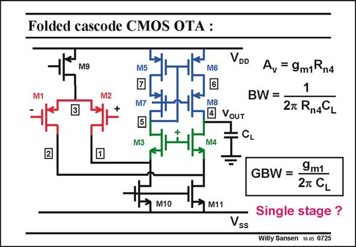

# SANSEN-0725 · Folded cascode CMOS OTA :

章节：07 常用运算放大器电路  
PDF 页：218；书本页：223；幻灯片编号：0725  
状态：unreviewed



## 对应教材讲解

### PDF 217 · 书本 222

The small-signal operation is easily understood. The input transistors create a circular current, which flows through the cascode transistors to the high-impedance node. The output resistance at node 4 is again R . n4

### PDF 218 · 书本 223

The voltage gain at low frequencies is now easily obtained. Note that this gain is high because cascodes are used. Gain boosting could be applied to the cascodes M4 and M8 to increase the gain even further. The bandwidth is created at the same output node. The GBW is the product. It is exactly the same as for a single-transistor amplifier. Of course, the input transconcuctance is smaller here, as only half of the current flows in the input stage. What is the advantage of this folded OTA? It consumes twice the current of a telescopic cascode stage!

## 公式／性能结论候选摘录

以下为规则截取的原文，尚未逐项判读。

- PDF 218: The voltage gain at low frequencies is now easily obtained.
- PDF 218: Note that this gain is high because cascodes are used.
- PDF 218: Gain boosting could be applied to the cascodes M4 and M8 to increase the gain even further.
- PDF 218: The bandwidth is created at the same output node.

## 曲线结论候选摘录

以下为规则截取的原文，尚未逐项判读。

（未由规则找到；不代表原页没有此类内容。）

## 原文条件与近似候选摘录

以下为规则截取的原文，尚未逐项判读。

（未由规则找到；不代表原页没有此类内容。）

## 幻灯片 OCR（未校正）

```text
Folded cascode CMOS OTA :
VDD
M9
M5
M6
M2
M7
A, = 9m1Rn4
BW=
2T Rn4CL
M3
M8
4 VoUT
: CL
M4
2
M10
M11
Vss
GBW =
9m1
2T CL
Single stage ?
Willy Sansen 10.05 0725
```

数学上下标、分数及正负号以原图为准。电路图已保留；未核对的连接不输出成可仿真 netlist。
