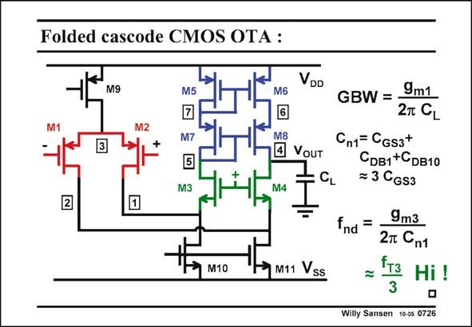

# SANSEN-0726 · Folded cascode CMOS OTA :

章节：07 常用运算放大器电路  
PDF 页：218；书本页：223；幻灯片编号：0726  
状态：unreviewed



## 对应教材讲解

### PDF 218 · 书本 223

In order to find the advantages of a folded cascode OTA, we have to verify the high-frequency performance. The non-dominant pole is created at the nodes 1 and 2. They form together one single non-dominant pole. The resistance at node 1 is 1/g and the capacitance at m3 this node is C . It is a sum n1 of three small capacitances, which are all similar in size. The non-dominant pole occurs at about one third of f . This is a very high frequency indeed. The GBW can therefore be quite high. T This is the first advantage of a folded OTA. Finally, note that the current mirror with transistors M5-M8 can also be used. Remember, however, that this current source requires more than 1 V to keep all transistors in saturation. This is the loss in output swing at each supply line. The previous current mirror is a lot better for low-voltage applications.

## 公式／性能结论候选摘录

以下为规则截取的原文，尚未逐项判读。

- PDF 218: The GBW can therefore be quite high.

## 曲线结论候选摘录

以下为规则截取的原文，尚未逐项判读。

（未由规则找到；不代表原页没有此类内容。）

## 原文条件与近似候选摘录

以下为规则截取的原文，尚未逐项判读。

- PDF 218: Remember, however, that this current source requires more than 1 V to keep all transistors in saturation.

## 幻灯片 OCR（未校正）

```text
Folded cascode CMOS OTA :
VDD
M9
M5
M6
M2
M7
M3
M8
• VouT
V4
CL
2
M10
M11 ss
GBW = •
9m1
2T CL
Cn1= Cgs3+
CDв1+CDB10
= 3 CGs3
ind
=
9m3
2m Cn1
{тз
Hi !
Willy Sansen 10-0s 0726
```

数学上下标、分数及正负号以原图为准。电路图已保留；未核对的连接不输出成可仿真 netlist。
