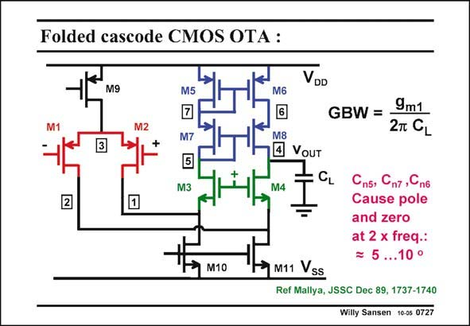

# SANSEN-0727 · Folded cascode CMOS OTA :

章节：07 常用运算放大器电路  
PDF 页：219；书本页：224；幻灯片编号：0727  
状态：unreviewed



## 对应教材讲解

### PDF 219 · 书本 224

The capacitances at the top nodes 5, 6 and 7 also cause non-dominant poles. They are followed by zeros however, at double the frequency. Indeed, each time we have a single-ended amplifier, the capacitances on the other side than the output, will be negligible for the Phase Margin. As a conclusion, this OTA has only one single nondominant pole. It is fairly easy to design. It also has the advantage that it is very fast.

## 公式／性能结论候选摘录

以下为规则截取的原文，尚未逐项判读。

- PDF 219: As a conclusion, this OTA has only one single nondominant pole.

## 曲线结论候选摘录

以下为规则截取的原文，尚未逐项判读。

- PDF 219: Indeed, each time we have a single-ended amplifier, the capacitances on the other side than the output, will be negligible for the Phase Margin.

## 原文条件与近似候选摘录

以下为规则截取的原文，尚未逐项判读。

（未由规则找到；不代表原页没有此类内容。）

## 幻灯片 OCR（未校正）

```text
Folded cascode CMOS OTA :
VDD
M9
M5
M6
M2
M7
GBW =
9m1
2T CL
M3
M8
• VouT
V4
2
M10
CL
Cn5,
Cn7,Cn6
Cause pole
and zero
at 2 x freq.:
5 ...10 °
M11 Vss
Ref Mallya, JSSC Dec 89, 1737-1740
Willy Sansen 10-05 0727
```

数学上下标、分数及正负号以原图为准。电路图已保留；未核对的连接不输出成可仿真 netlist。
