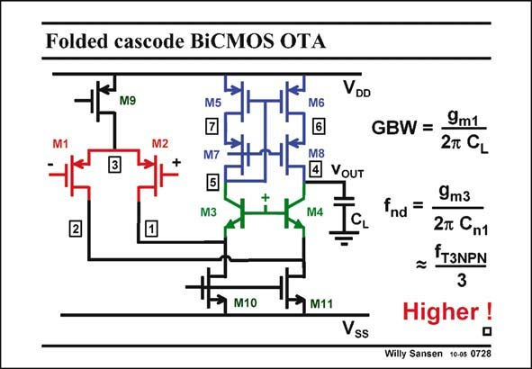

# SANSEN-0728 · Folded cascode BiCMOS OTA

章节：07 常用运算放大器电路  
PDF 页：219；书本页：224；幻灯片编号：0728  
状态：unreviewed



## 对应教材讲解

### PDF 219 · 书本 224

Would a BiCMOS folded OTA be even faster? The only good position for bipolar transistors to be plugged in, is as cascode devices. Indeed, this is where we need the highest-speed devices. The non-dominant pole at nodes 1 and 2 are linked to the f of the cas- T codes. This is higher than the f of the nMOST f T T within a particular BiCMOS technology. Remember that this is not necessarily higher than for nMOSTs in a more recent standard CMOS technology. Never use bipolar devices for the transistors M10 and M11 in the DC current sources. Their collector-substrate capacitances would reduce the non-dominant pole at nodes 1 and 2 too much!

## 公式／性能结论候选摘录

以下为规则截取的原文，尚未逐项判读。

（未由规则找到；不代表原页没有此类内容。）

## 曲线结论候选摘录

以下为规则截取的原文，尚未逐项判读。

（未由规则找到；不代表原页没有此类内容。）

## 原文条件与近似候选摘录

以下为规则截取的原文，尚未逐项判读。

（未由规则找到；不代表原页没有此类内容。）

## 幻灯片 OCR（未校正）

```text
Folded cascode BiCMOS OTA
VDD
M9
M5
M6
M2
M7
M3
M8
• VouT
M4
GBW = -
9m1
2T CL
9m3
Ind =
2т Сп1
IT3NPN
M10
M11
Vss
Higher !
Willy Sansen 10-05 0728
```

数学上下标、分数及正负号以原图为准。电路图已保留；未核对的连接不输出成可仿真 netlist。
