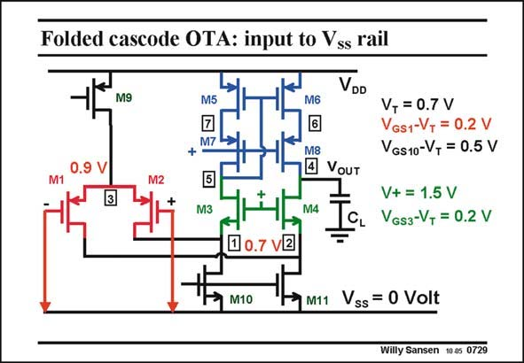

# SANSEN-0729 · Folded cascode OTA: input to Vss rail

章节：07 常用运算放大器电路  
PDF 页：220；书本页：225；幻灯片编号：0729  
状态：unreviewed



## 对应教材讲解

### PDF 219 · 书本 224

The second important advantage of a folded cascode OTA is that the input transistors can operate with their Gates beyond the supply lines. The common-mode input voltage range can include one of the supply rails! In the circuit in this slide, the pMOST devices at the input still operate when the Gates are connected to ground, or even below ground. The V values of the input transistors are easily GS

### PDF 220 · 书本 225

0.9 V (for V =0.7 V), which T is more than sufficient to accommodate the V and DS1 V . DS10 If V is about 0.2 V and DS1 V =0.5 V, then the input DS10 transistors can still operate with their gates at 0.2 V below ground! A folded cascode opamp include the ground rail. This is why they have been often used for single-supply systems such as automotive applications before, but now also for all mixed-signal applications, in which the processors use only one single supply line. Moreover, connecting two folded cascodes in parallel, one with pMOSTs at the input and another one with nMOSTs at the input, allows coverage of the full rail-to-rail range. This is how rail-to-rail input opamps are put together! These are discussed in Chapter 11.

## 公式／性能结论候选摘录

以下为规则截取的原文，尚未逐项判读。

（未由规则找到；不代表原页没有此类内容。）

## 曲线结论候选摘录

以下为规则截取的原文，尚未逐项判读。

（未由规则找到；不代表原页没有此类内容。）

## 原文条件与近似候选摘录

以下为规则截取的原文，尚未逐项判读。

（未由规则找到；不代表原页没有此类内容。）

## 幻灯片 OCR（未校正）

```text
Folded cascode OTA: input to Vss rail
VDD
M9
M5
M6
•.
M3
M8
4 VoUT
M4
V, = 0.7 V
GS1-V+ = 0.2 V
VGs10-V+ = 0.5 V
V+ = 1.5 V
VGs3-V, = 0.2 V
v2
M10
M11
Vss = 0 Volt
Willy Sansen 1005 0729
```

数学上下标、分数及正负号以原图为准。电路图已保留；未核对的连接不输出成可仿真 netlist。
