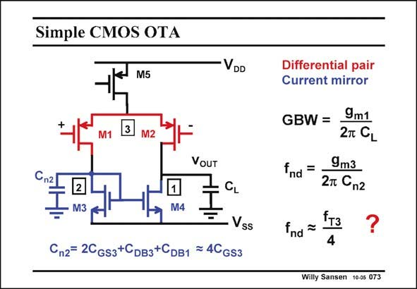

# SANSEN-073 · Simple CMOS OTA

章节：07 常用运算放大器电路  
PDF 页：207；书本页：212；幻灯片编号：073  
状态：unreviewed



## 对应教材讲解

### PDF 207 · 书本 212

This single-stage CMOS OTA is well known. Because it has a simple configuration means that it can be used up to really high frequencies. Its only possible second pole is negligible because of two reasons. it occurs at values related to f T and secondly because this node is on the other side of the output. For a singleended amplifier this means that this second pole is followed by a zero at twice the frequency. As a result, it is negligible.

## 公式／性能结论候选摘录

以下为规则截取的原文，尚未逐项判读。

- PDF 207: As a result, it is negligible.

## 曲线结论候选摘录

以下为规则截取的原文，尚未逐项判读。

（未由规则找到；不代表原页没有此类内容。）

## 原文条件与近似候选摘录

以下为规则截取的原文，尚未逐项判读。

（未由规则找到；不代表原页没有此类内容。）

## 幻灯片 OCR（未校正）

```text
Simple CMOS OTA
M5
VDD
M1
3
M2
VOUT
M3
M4
Vss
Cn2= 2CGs3+CDв3+CDB1 = 4CGs3
Differential pair
Current mirror
GBW =
9m1
2T CL
fnd =
9m3
2т Cn2
fnd
?
4
Willy Sansen 10-05 073
```

数学上下标、分数及正负号以原图为准。电路图已保留；未核对的连接不输出成可仿真 netlist。
