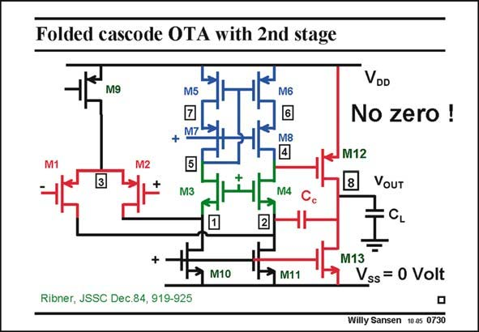

# SANSEN-0730 · Folded cascode OTA with 2nd stage

章节：07 常用运算放大器电路  
PDF 页：220；书本页：225；幻灯片编号：0730  
状态：unreviewed



## 对应教材讲解

### PDF 220 · 书本 225

The folded cascode OTA is also an excellent first stage for a two-stage Miller CMOS OTA. As usual the second stage is just one single transistor with active load. As a result, the GBW is set by g and C . Now m1 c there are two nondominant poles, however. The lowerfrequency one is normally at the output. The other, at nodes 1 and 2 are usually at the highest frequency. Because of the second stage, the output swing can be rail-to-rail. Indeed, even when the output voltage is very close to the positive supply voltage, and the output transistor M12 enters the linear region, and loses its gain, there is still sufficient gain remaining in the first stage to suppress the distortion.

## 公式／性能结论候选摘录

以下为规则截取的原文，尚未逐项判读。

- PDF 220: As a result, the GBW is set by g and C .
- PDF 220: Indeed, even when the output voltage is very close to the positive supply voltage, and the output transistor M12 enters the linear region, and loses its gain, there is still sufficient gain remaining in the first stage to suppress the distortion.

## 曲线结论候选摘录

以下为规则截取的原文，尚未逐项判读。

（未由规则找到；不代表原页没有此类内容。）

## 原文条件与近似候选摘录

以下为规则截取的原文，尚未逐项判读。

（未由规则找到；不代表原页没有此类内容。）

## 幻灯片 OCR（未校正）

```text
Folded cascode OTA with 2nd stage
M9
M5
M6
M7
+
M8
4
VoD
No zero !
IM12
M3
M4
2
VouT
CL
+
M13
M10
M11
Vss = 0 Volt
Ribner, JSSC Dec.84, 919-925
Willy Sansen 1005 0730
```

数学上下标、分数及正负号以原图为准。电路图已保留；未核对的连接不输出成可仿真 netlist。
