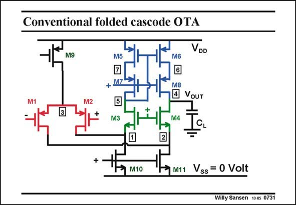

# SANSEN-0731 · Conventional folded cascode OTA

章节：07 常用运算放大器电路  
PDF 页：221；书本页：226；幻灯片编号：0731  
状态：unreviewed



## 对应教材讲解

### PDF 221 · 书本 226

For sake of comparison, the conventional folded cascode OTA is repeated. The top current mirror M5-M8 can also be realized in a different way, as shown next.

## 公式／性能结论候选摘录

以下为规则截取的原文，尚未逐项判读。

（未由规则找到；不代表原页没有此类内容。）

## 曲线结论候选摘录

以下为规则截取的原文，尚未逐项判读。

（未由规则找到；不代表原页没有此类内容。）

## 原文条件与近似候选摘录

以下为规则截取的原文，尚未逐项判读。

（未由规则找到；不代表原页没有此类内容。）

## 幻灯片 OCR（未校正）

```text
Conventional folded cascode OTA
M9
VDD
M5
M6
+ M7
+
M3
M8
4 VoUT
M4
M10
M11
Vss = 0 Volt
Willy Sansen 1005 0731
```

数学上下标、分数及正负号以原图为准。电路图已保留；未核对的连接不输出成可仿真 netlist。
