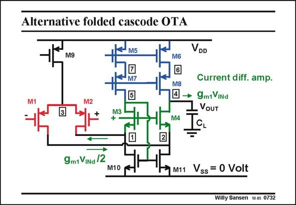

# SANSEN-0732 · Alternative folded cascode OTA

章节：07 常用运算放大器电路  
PDF 页：221；书本页：226；幻灯片编号：0732  
状态：unreviewed



## 对应教材讲解

### PDF 221 · 书本 226

In this alternative folded cascode OTA, the current mirroring is carried out around the cascodes themselves. Indeed, transistors M3/ M4 are also the cascodes in the differential current amplifier formed by M3/ M4 and M10/M11. Such an amplifier provides the difference between the input currents, as explained in Chapter 2. These input currents are the same in amplitude but opposite in phase, as they come directly from the input pair. The output current in the load capacitance is simply g v . m1 ind Let us try to discover what the differences are with the previous conventional folded cascode OTA. Clearly, the gain and output impedance are the same. The number of biasing lines is one less as M5–6 and M9 can share the same Gate line. The main difference however, is in the impedance seen by the input transistors. In the conventional folded cascode, the input devices see exactly the same impedance. In the alternative configuration, transistor M1 sees 1/g but transistor M2 sees 1/g divided by the gain of m4 m3 transistor M3 or g r . This is much smaller! m3 o3 The alternative folded cascode OTA is therefore a bit less symmetrical. This will be visible in the higher-order poles and zeros, which are of less concern to us!

## 公式／性能结论候选摘录

以下为规则截取的原文，尚未逐项判读。

- PDF 221: Clearly, the gain and output impedance are the same.
- PDF 221: In the alternative configuration, transistor M1 sees 1/g but transistor M2 sees 1/g divided by the gain of m4 m3 transistor M3 or g r .
- PDF 221: This is much smaller! m3 o3 The alternative folded cascode OTA is therefore a bit less symmetrical.

## 曲线结论候选摘录

以下为规则截取的原文，尚未逐项判读。

- PDF 221: These input currents are the same in amplitude but opposite in phase, as they come directly from the input pair.

## 原文条件与近似候选摘录

以下为规则截取的原文，尚未逐项判读。

- PDF 221: This is much smaller! m3 o3 The alternative folded cascode OTA is therefore a bit less symmetrical.

## 幻灯片 OCR（未校正）

```text
Alternative folded cascode OTA
M5
VDD
M9
M6
Current diff. amp.
M8
14 → 9mtVINd
VoUT
M3
9m1 VINa /2
M10
M11
Vss = 0 Volt
Willy Sansen 10.05 0732
```

数学上下标、分数及正负号以原图为准。电路图已保留；未核对的连接不输出成可仿真 netlist。
