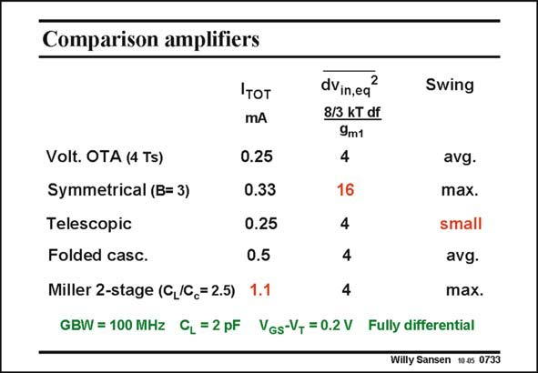

# SANSEN-0733 · Comparison amplifiers

章节：07 常用运算放大器电路  
PDF 页：222；书本页：227；幻灯片编号：0733  
状态：unreviewed



## 对应教材讲解

### PDF 222 · 书本 227

For sake of comparison, a short table is given listing the main advantages and disadvantages. The four-transistor singlestage voltage differential amplifier is the first on the list. It is followed by a symmetrical CMOS OTA. Then we have two cascode CMOS OTA’s. Finally, a two-stage Miller CMOS OTA is added. It is clear that the Miller CMOS OTA takes the highest power consumption. The best one is a telescopic cascode. For high output swing, the telescopic cascode OTA is the worst one. The best are the Miller CMOS OTA and the symmetrical one, at least if no cascodes are used! The symmetrical OTA is the worst for noise, however. This shows that even for as few as three specifications, not one single amplifier can be called the best. Many designers prefer a folded cascode OTA, which is certainly a good compromise.

## 公式／性能结论候选摘录

以下为规则截取的原文，尚未逐项判读。

（未由规则找到；不代表原页没有此类内容。）

## 曲线结论候选摘录

以下为规则截取的原文，尚未逐项判读。

（未由规则找到；不代表原页没有此类内容。）

## 原文条件与近似候选摘录

以下为规则截取的原文，尚未逐项判读。

（未由规则找到；不代表原页没有此类内容。）

## 幻灯片 OCR（未校正）

```text
Comparison amplifiers
Iтот
mA
Volt. OTA (4 Ts)
Symmetrical (B= 3)
Telescopic
Folded casc.
0.25
0.33
0.25
0.5
Miller 2-stage (G,/C = 2.5)
1.1
dVin,eq
2
8/3 KT df
9m1
4
16
4
4
4
Swing
avg.
max.
small
GBW = 100 MHz CL =2pF VGs-V, = 0.2V Fully differential
avg.
max.
Willy Sansen 100s 0733
```

数学上下标、分数及正负号以原图为准。电路图已保留；未核对的连接不输出成可仿真 netlist。
