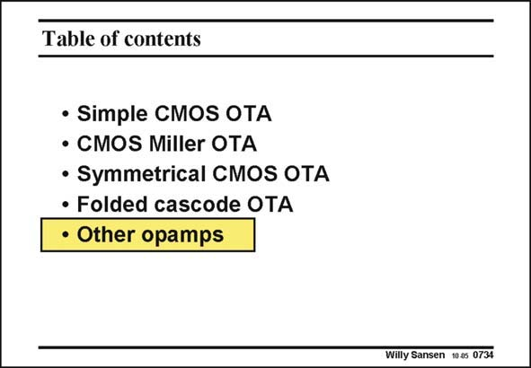

# SANSEN-0734 · Table of contents

章节：07 常用运算放大器电路  
PDF 页：222；书本页：227；幻灯片编号：0734  
状态：unreviewed



## 对应教材讲解

### PDF 222 · 书本 227

Many more opamp configurations can be added. They are all included in this list because they have some peculiarity which is worth investigating. We will always try to recognize the design principles which we have studied before. We will try to find out whether one single or two stages are used. We want to know which trick has been used to abolish the positive zero. Also, we want to recognize the structure of a symmetrical or folded cascode, etc. Some of these are fully-differential. This means that they have two outputs and require common-mode feedback. This will be explained in the next Chapter, however. We focus here on their circuit configuration, without being affected by their differential nature.

## 公式／性能结论候选摘录

以下为规则截取的原文，尚未逐项判读。

（未由规则找到；不代表原页没有此类内容。）

## 曲线结论候选摘录

以下为规则截取的原文，尚未逐项判读。

（未由规则找到；不代表原页没有此类内容。）

## 原文条件与近似候选摘录

以下为规则截取的原文，尚未逐项判读。

（未由规则找到；不代表原页没有此类内容。）

## 幻灯片 OCR（未校正）

```text
Table of contents
• Simple CMOS OTA
• CMOS Miller OTA
• Symmetrical CMOS OTA
• Folded cascode OTA
• Other opamps
Willy Sansen 1005 0734
```

数学上下标、分数及正负号以原图为准。电路图已保留；未核对的连接不输出成可仿真 netlist。
