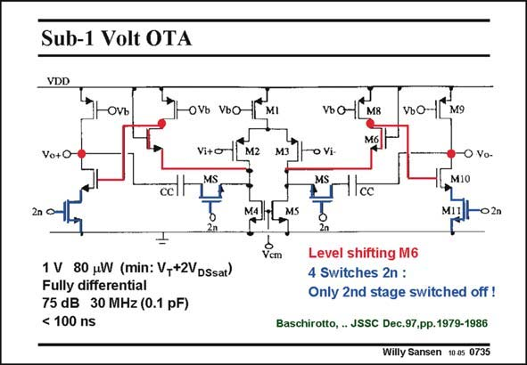

# SANSEN-0735 · Sub-1 Volt OTA

章节：07 常用运算放大器电路  
PDF 页：223；书本页：228；幻灯片编号：0735  
状态：unreviewed



## 对应教材讲解

### PDF 223 · 书本 228

The first one in the list is an OTA which works on a mere 1 V supply voltage. Moreover, this OTA can be switched in and out. To verify the operation, we must close all four (blue) switches. Clearly, a two-stage Miller CMOS OTA emerges, with a folded-cascode as a first stage. Because of the low supply voltage, transistor M8 does not have a cascode. The gain will therefore not be that high. A second stage provides a good remedy, however. Obviously, the compensation capacitance CC does not connect Drain to Gate directly around output transistor M10. It takes a path through cascode device M6, in order to avoid a positive zero. Finally, note that the common-mode input voltage range is just about zero. Indeed the sum of V and V is about 1 V. The Gates of the input devices can only operate around zero. DS1 GS3 On the other hand, the average output voltage will be 0.5 V to maximize the output swing. As a consequence, the output can never be directly connected to the input, to make a buffer for example. A level shifter over 0.5 V will have to be inserted between output and input.

## 公式／性能结论候选摘录

以下为规则截取的原文，尚未逐项判读。

- PDF 223: The gain will therefore not be that high.

## 曲线结论候选摘录

以下为规则截取的原文，尚未逐项判读。

（未由规则找到；不代表原页没有此类内容。）

## 原文条件与近似候选摘录

以下为规则截取的原文，尚未逐项判读。

（未由规则找到；不代表原页没有此类内容。）

## 幻灯片 OCR（未校正）

```text
Sub-1 Volt OTA
VDD
OVЪ
OVь VьO
Vo+O-
Vi+o
2n •
1 V 80 uW (min: V-+2VDSsat)
Fully differential
75 dB 30 MHz (0.1 pF)
< 100 ns
VьOM
M8
VьО-
M9
o Vi-
• Vo-
M10
Icc
M1
-02n
Vcm
Level shifting M6
4 Switches 2n :
Only 2nd stage switched off !
Baschirotto, . JSSC Dec.97,pp.1979-1986
Willy Sansen 1005 0735
```

数学上下标、分数及正负号以原图为准。电路图已保留；未核对的连接不输出成可仿真 netlist。
