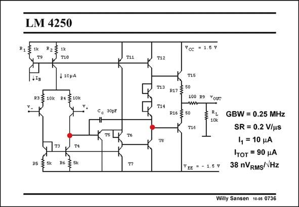

# SANSEN-0736 · Slide 0736

章节：07 常用运算放大器电路  
PDF 页：223；书本页：228；幻灯片编号：0736  
状态：unreviewed



## 对应教材讲解

### PDF 223 · 书本 228

A very conventional twostage Miller opamp with bipolar transistors is shown in this slide. It can be used for supply voltages down to ±1.5 V. Each high-impedance point is indicated by means of a red dot. It is clearly a two-stage amplifier with a class AB output stage. The GBW is obviously determined by the input transconductance and the 30 pF compensation capacitance. Bipolar transistors have sufficient transconductance not to have problems with positive zeros. With bipolar transistors, an emitter follower is required between input and second stage. This

### PDF 224 · 书本 229

transistor is T5. A level shifter T6 then follows to reduce the voltage to about 0.7 V, the V of BE transistor T8. This level shifter is also required to reach this low supply voltage. In the input stage, series resistors of 10 kV are used to increase the Slew-Rate. The output stage consists of two emitter followers. As a consequence twice a V of about BE 0.7 V is lost in the output swing. For such large supply voltages, we do not mind so much. For smaller supply voltages or larger output swings we must use two Collector-to-collector output devices, as we have previously seen in most opamps. Diodes T13/T14 are used to set the quiescent current in the output devices.

## 公式／性能结论候选摘录

以下为规则截取的原文，尚未逐项判读。

- PDF 224: In the input stage, series resistors of 10 kV are used to increase the Slew-Rate.

## 曲线结论候选摘录

以下为规则截取的原文，尚未逐项判读。

（未由规则找到；不代表原页没有此类内容。）

## 原文条件与近似候选摘录

以下为规则截取的原文，尚未逐项判读。

（未由规则找到；不代表原页没有此类内容。）

## 幻灯片 OCR（未校正）

```text
LM 4250
P23 Ix
T1O
+10gA
10k
R§LOK
T4
85 3 5K
С. 30рг
T11
T6
T12
713
T14
т8
"oc
= 1.5Y
R17
50
3 50
T15
100 R9
Your
T16
VIE * - 1,5 %
RL GBW = 0.25 MHz
SR = 0.2 V/u
4 = 10 A
тот = 90 JA
38 nVRMS/VHz
Willy Sansen 10-05 0736
```

数学上下标、分数及正负号以原图为准。电路图已保留；未核对的连接不输出成可仿真 netlist。
