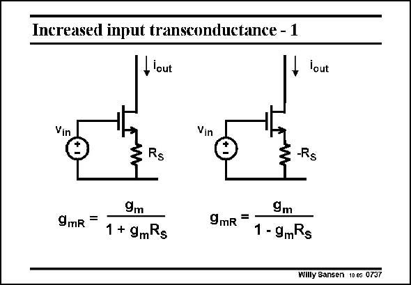

# SANSEN-0737 · Increased input transconductance - 1

章节：07 常用运算放大器电路  
PDF 页：224；书本页：229；幻灯片编号：0737  
状态：unreviewed



## 对应教材讲解

### PDF 224 · 书本 229

An attempt to raise the transconductance of MOSTs to higher values is shown here. It starts with inserting a series resistor. This is obviously going to decrease the transconductance. It can increase the transconsuctance, provided we can make the resistor negative. For example, if we can make g R =0.8, then m S g will be 5 times g . mR m It is too difficult, however, to match a g to a resistor m R to obtain an accurate S value of, for example, 0.8.

## 公式／性能结论候选摘录

以下为规则截取的原文，尚未逐项判读。

- PDF 224: This is obviously going to decrease the transconductance.
- PDF 224: It can increase the transconsuctance, provided we can make the resistor negative.

## 曲线结论候选摘录

以下为规则截取的原文，尚未逐项判读。

（未由规则找到；不代表原页没有此类内容。）

## 原文条件与近似候选摘录

以下为规则截取的原文，尚未逐项判读。

- PDF 224: It can increase the transconsuctance, provided we can make the resistor negative.

## 幻灯片 OCR（未校正）

```text
Increased input transconductance - 1
lout
lout
Vin
Vin
Rs
-Rs
9mR =
9m
1 + 9mRs
9m
9mR =
1 - 9mRs
Willy Sansen 10 €s 0737
```

数学上下标、分数及正负号以原图为准。电路图已保留；未核对的连接不输出成可仿真 netlist。
