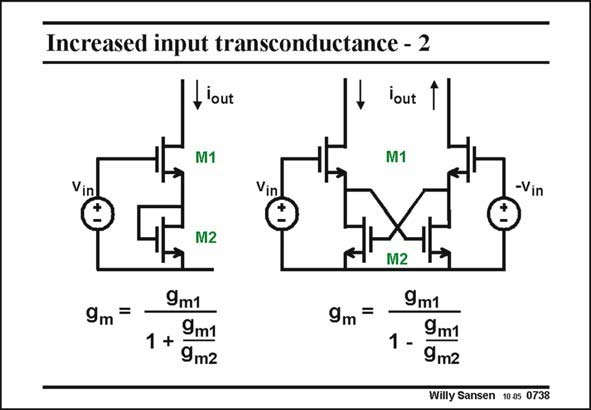

# SANSEN-0738 · Increased input transconductance - 2

章节：07 常用运算放大器电路  
PDF 页：224；书本页：229；幻灯片编号：0738  
状态：unreviewed



## 对应教材讲解

### PDF 224 · 书本 229

This matching is quite feasible provided we take two nMOST devices, the bottom of which is connected as a diode. Since both carry equal DC currents, the g m ratio is now the square root of the W/L ratio, or the V −V ratio, and this can GS T be made quite accurate. Moreover, a negative resistance is easily realized in differential form, as shown in this slide. If we can make a layout with a W/L ratio of 0.5, for

### PDF 225 · 书本 230

example, then the g ratio is 0.71 and the transconductance goes up by a factor of about 3. We m could push this a bit more of course! A full OTA realization is shown next.

## 公式／性能结论候选摘录

以下为规则截取的原文，尚未逐项判读。

- PDF 224: Since both carry equal DC currents, the g m ratio is now the square root of the W/L ratio, or the V −V ratio, and this can GS T be made quite accurate.

## 曲线结论候选摘录

以下为规则截取的原文，尚未逐项判读。

（未由规则找到；不代表原页没有此类内容。）

## 原文条件与近似候选摘录

以下为规则截取的原文，尚未逐项判读。

- PDF 224: This matching is quite feasible provided we take two nMOST devices, the bottom of which is connected as a diode.

## 幻灯片 OCR（未校正）

```text
Increased input transconductance - 2
lout
M1
lout 1
M1
Vin
Vin
-Vin
9m=
M2
9m1
1+ 9m1
9m2
M2
9m =
9m1
1- 9m2
Willy Sansen 1005 0738
```

数学上下标、分数及正负号以原图为准。电路图已保留；未核对的连接不输出成可仿真 netlist。
