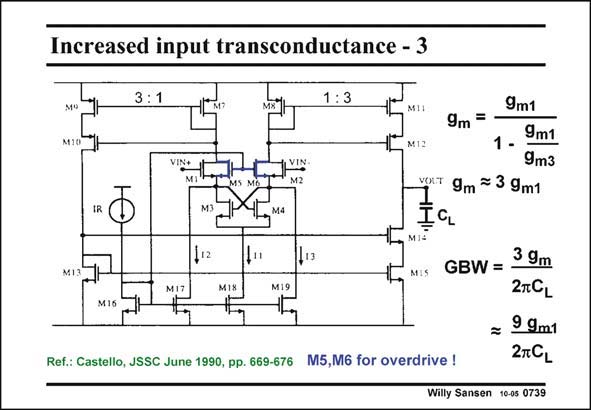

# SANSEN-0739 · Increased input transconductance - 3

章节：07 常用运算放大器电路  
PDF 页：225；书本页：230；幻灯片编号：0739  
状态：unreviewed



## 对应教材讲解

### PDF 225 · 书本 230

This is clearly a symmetrical CMOS OTA, with a B factor of three. The input devices have negative series resistances to increase the input transconductance. Two more transistors M5 and M6 are added to avoid latch-up of the input stage. After all, negative resistors are used in oscillators, in comparators, in flip-flops, etc., because they are regenerative. They may cause latch-up when overdriven. Transistors M5 and M6 have to prevent this. Such an Operational Transconductor Amplifier is also called Transconductor, because it allows larger input voltages with low distortion.

## 公式／性能结论候选摘录

以下为规则截取的原文，尚未逐项判读。

- PDF 225: The input devices have negative series resistances to increase the input transconductance.

## 曲线结论候选摘录

以下为规则截取的原文，尚未逐项判读。

（未由规则找到；不代表原页没有此类内容。）

## 原文条件与近似候选摘录

以下为规则截取的原文，尚未逐项判读。

（未由规则找到；不代表原页没有此类内容。）

## 幻灯片 OCR（未校正）

```text
Increased input transconductance - 3
3:1
1:3
VIN+
9m =
9m1
1 -
9m1
9m3
woT 9m = 3 9m1
M16
Ref.: Castello, JSSC June 1990, pp. 669-676
M5,M6 for overdrive !
MI:
Mis GBW= 39m
2TCL
= 99m1
2TCL
Willy Sansen 10-05 0739
```

数学上下标、分数及正负号以原图为准。电路图已保留；未核对的连接不输出成可仿真 netlist。
