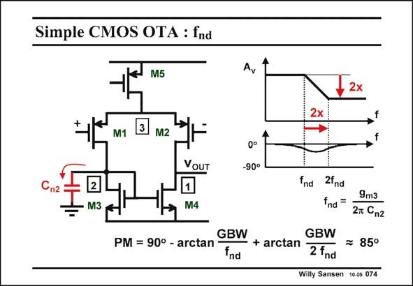

# SANSEN-074 · Simple CMOS OTA : fnd

章节：07 常用运算放大器电路  
PDF 页：207；书本页：212；幻灯片编号：074  
状态：unreviewed



## 对应教材讲解

### PDF 207 · 书本 212

Even if we connected a large external capacitance at node 2, we would still find half of the circular current, generated by M1 and M2, through the output load. Whatever the size of the capacitor is, we always retain half of the current through the output load. This factor of two can only be explained by a pole-zero doublet with spreading two. Its effect on the phase margin is therefore marginally small. Each time we have a single-ended amplifier, the capacitances on the other side than the output, will therefore be negligible for the Phase Margin.

## 公式／性能结论候选摘录

以下为规则截取的原文，尚未逐项判读。

- PDF 207: Its effect on the phase margin is therefore marginally small.
- PDF 207: Each time we have a single-ended amplifier, the capacitances on the other side than the output, will therefore be negligible for the Phase Margin.

## 曲线结论候选摘录

以下为规则截取的原文，尚未逐项判读。

- PDF 207: Its effect on the phase margin is therefore marginally small.
- PDF 207: Each time we have a single-ended amplifier, the capacitances on the other side than the output, will therefore be negligible for the Phase Margin.

## 原文条件与近似候选摘录

以下为规则截取的原文，尚未逐项判读。

（未由规则找到；不代表原页没有此类内容。）

## 幻灯片 OCR（未校正）

```text
Simple CMOS OTA : fnd
M5
Av
2x
2x
M1
M2
VOUT
0°
-90°
"n2
2
M3
M4
fnd 2fnd
9m3
fnd=
27 Cn2
GBW
GBW
PM = 90° - arctan
fnd
- + arctan 2 fnd
= 85°
Willy Sansen 10-05 074
```

数学上下标、分数及正负号以原图为准。电路图已保留；未核对的连接不输出成可仿真 netlist。
