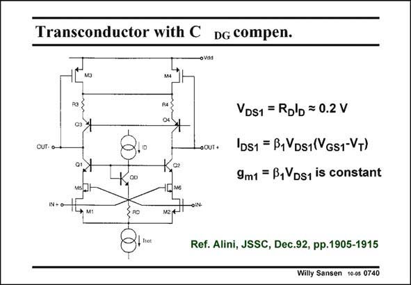

# SANSEN-0740 · Transconductor with C DG compen.

章节：07 常用运算放大器电路  
PDF 页：225；书本页：230；幻灯片编号：0740  
状态：unreviewed



## 对应教材讲解

### PDF 225 · 书本 230

Another transconductor with high-speed capability is shown in this slide. It is little more than a differential single-stage voltage amplifier with cascodes. However, the input transistors operate in the linear region. This is achieved on purpose to avoid distortion, when driven with large input signal levels. Indeed, in the linear region the current is proportional to V , not to V 2. GS GS As a result, the transconductance is constant provided V can be kept constant. DS This is achieved by fixing the voltage across resistor R by means of a constant current I . D D Obviously, the transconductance in the linear region is smaller than in saturation. Lower

### PDF 226 · 书本 231

distortion always goes together with lower gain though! Feedback does this too, exchanging gain for low distortion. In order to boost the high-frequency performance, two small capacitances are added by means of transistors M5 and M6. They are added to compensate the input capacitances C of the GS input transistors. They are connected to nodes at opposite polarity. For a size of about one third, compensation can be achieved. This is why they are drawn smaller!

## 公式／性能结论候选摘录

以下为规则截取的原文，尚未逐项判读。

- PDF 225: Indeed, in the linear region the current is proportional to V , not to V 2.
- PDF 225: GS GS As a result, the transconductance is constant provided V can be kept constant.
- PDF 226: distortion always goes together with lower gain though!
- PDF 226: Feedback does this too, exchanging gain for low distortion.

## 曲线结论候选摘录

以下为规则截取的原文，尚未逐项判读。

（未由规则找到；不代表原页没有此类内容。）

## 原文条件与近似候选摘录

以下为规则截取的原文，尚未逐项判读。

- PDF 225: GS GS As a result, the transconductance is constant provided V can be kept constant.
- PDF 225: D D Obviously, the transconductance in the linear region is smaller than in saturation.

## 幻灯片 OCR（未校正）

```text
Transconductor with C DG compen.
мз
OUT- O
•OUT+
VDS1 = Rolb = 0.2 V
IDs1 = B1VDs1(VGs1-VT)
9m1 = B,VDs1 is constant
IN + 0-
* м:
RO
Ref. Alini, JSSC, Dec.92, pp.1905-1915
Willy Sansen 10-05 0740
```

数学上下标、分数及正负号以原图为准。电路图已保留；未核对的连接不输出成可仿真 netlist。
