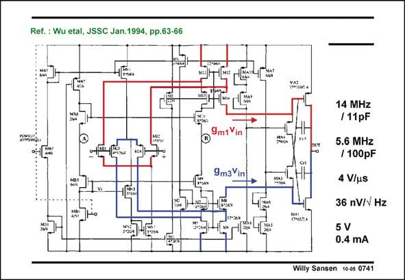

# SANSEN-0741 · Ref.: Wu etal, JSSC Jan.1994, pp.63-66

章节：07 常用运算放大器电路  
PDF 页：226；书本页：231；幻灯片编号：0741  
状态：unreviewed



## 对应教材讲解

### PDF 226 · 书本 231

This is the first fully rail-torail amplifier that we will discuss, is shown in this slide. It provides rail-to-rail capability at both the input and the output. It can be connected in unity gain as a buffer. It has a class AB output stage to be able to provide large output currents indeed. At the input two folded cascode stages are connected in parallel. The common-mode input range thus includes both supply lines. Their outputs are applied to two differential current amplifiers, ending up at the Gates of the two large output devices. These devices are the output stage. We have a two-stage Miller opamp. The compensation capacitances are clearly distinguished. However, they connect directly Drain to Gate. Perhaps it is better to find a path through one of the cascodes. For example C may be better connected to the source of M14! c2 The Gates of the output transistors are at very high impedance. It may not appear like that because these nodes are also connected to two Sources of transistors MA3 and MA4. Sources suggest impedance levels of 1/g . This is not the case here however, as these two transistors are m bootstrapped out. This is explained later. The rail-to-rail input stage can cause large variations in GBW, however. This is examined first.

## 公式／性能结论候选摘录

以下为规则截取的原文，尚未逐项判读。

- PDF 226: It can be connected in unity gain as a buffer.
- PDF 226: The common-mode input range thus includes both supply lines.

## 曲线结论候选摘录

以下为规则截取的原文，尚未逐项判读。

（未由规则找到；不代表原页没有此类内容。）

## 原文条件与近似候选摘录

以下为规则截取的原文，尚未逐项判读。

（未由规则找到；不代表原页没有此类内容。）

## 幻灯片 OCR（未校正）

```text
Ref.: Wu etal, JSSC Jan.1994, pp.63-66
9m1 Vin
9m3Vin
14 MHz
/11pF
5.6 MHz
/ 100pF
4 V/us
36 nV/v Hz
5 V
0.4 mA
Willy Sansen 1005 0741
```

数学上下标、分数及正负号以原图为准。电路图已保留；未核对的连接不输出成可仿真 netlist。
