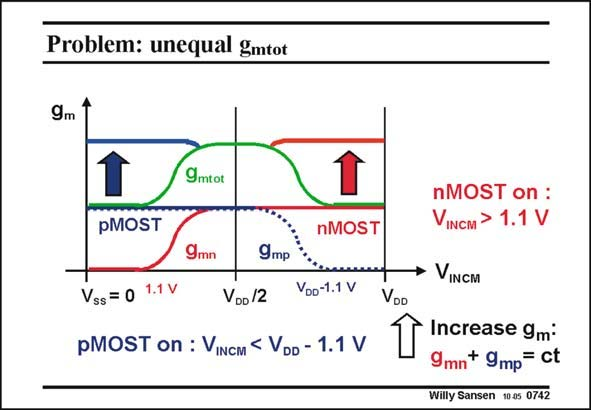

# SANSEN-0742 · Problem: unequal gmtot

章节：07 常用运算放大器电路  
PDF 页：227；书本页：232；幻灯片编号：0742  
状态：unreviewed



## 对应教材讲解

### PDF 226 · 书本 231

Indeed, for common-mode or average input signals in the middle, both input stages are in operation. The total transconductance is now the sum of the transconductances of the nMOSTs and pMOSTs at the input. For higher common-mode input signals however, the pMOSTs are shut off. The transconductance is now only half. The same is true for low common-mode input signals. The total transconductance has a bell shape versus the input common-mode input voltage, as shown in this slide, and so does the GBW. This gives a lot of distortion.

### PDF 227 · 书本 232

Some circuitry has to be added to equalize the transconductance over the full common-mode input range. In other words, for low common-mode input voltages, we need to double the transconductance of the pMOSTs; for high voltages, we need to double the transconductances of the nMOSTs. Various circuits can be devised to carry out such a task. One of these is explained next. The others are discussed in Chapter 11.

## 公式／性能结论候选摘录

以下为规则截取的原文，尚未逐项判读。

- PDF 227: Some circuitry has to be added to equalize the transconductance over the full common-mode input range.

## 曲线结论候选摘录

以下为规则截取的原文，尚未逐项判读。

（未由规则找到；不代表原页没有此类内容。）

## 原文条件与近似候选摘录

以下为规则截取的原文，尚未逐项判读。

（未由规则找到；不代表原页没有此类内容。）

## 幻灯片 OCR（未校正）

```text
Problem: unequal gmtot
9m
/9mtot
pMOST
nMOST
9mn
9mр
Vss = 0 1.1 V
VDo /2
VDo-1.1 V
pMOST on : VINCM < VDD - 1.1 V
VDD
nMOST on :
VINCM > 1.1 V
• VINCM
Increase 9m*
9mn+ 9mp= ct
Willy Sansen 10.05 0742
```

数学上下标、分数及正负号以原图为准。电路图已保留；未核对的连接不输出成可仿真 netlist。
