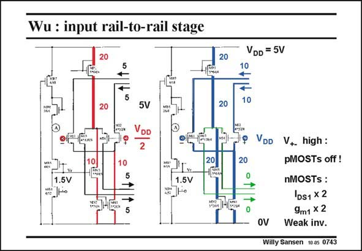

# SANSEN-0743 · Wu : input rail-to-rail stage VDD = 5V

章节：07 常用运算放大器电路  
PDF 页：227；书本页：232；幻灯片编号：0743  
状态：unreviewed



## 对应教材讲解

### PDF 227 · 书本 232

The input stage of the railto-rail opamp is repeated in this slide. The current which flows in a branch is indicated by the thickness of line. The input circuit is repeated twice, once for a commonmode input voltage halfway the supply voltages. The other is the situation when the inputs are connected to the positive supply. When the inputs are halfway the supply voltage, the DC currents through all input devices are equal (and about 5 mA). However the DC current source for the pMOST differential pair carries a current of 20 mA. Indeed, half of this current flows through a cascode MN3 to a current mirror which serves the nMOST differential pair. When the input voltage goes up, towards the positive supply voltage, then the V of this GS cascode transistor MN3 is increased, such that it takes the full 20 mA. As a result, the nMOST differential pair receives the full 20 mA. On the other hand, the pMOST differential pair is left without DC current. As a consequence, the current in the nMOST pair is multiplied by 2. This is not sufficient if the input devices work in saturation. This is sufficient if the input devices work in the weak inversion region. Doubling the current then doubles the transconductance. The sizes of the input devices are so large that the input devices are more likely going to work in weak inversion. After all, the GBW is only 14 MHz, which is quite feasible in weak inversion.

## 公式／性能结论候选摘录

以下为规则截取的原文，尚未逐项判读。

- PDF 227: When the inputs are halfway the supply voltage, the DC currents through all input devices are equal (and about 5 mA).
- PDF 227: When the input voltage goes up, towards the positive supply voltage, then the V of this GS cascode transistor MN3 is increased, such that it takes the full 20 mA.
- PDF 227: As a result, the nMOST differential pair receives the full 20 mA.

## 曲线结论候选摘录

以下为规则截取的原文，尚未逐项判读。

（未由规则找到；不代表原页没有此类内容。）

## 原文条件与近似候选摘录

以下为规则截取的原文，尚未逐项判读。

- PDF 227: This is not sufficient if the input devices work in saturation.

## 幻灯片 OCR（未校正）

```text
Wu : input rail-to-rail stage
20
5
5V
DD
2
10.
20
1.5V
1.5V
20
20
VDD = 5V
10
10
20
VDD
V+ high:
pMOSTs off!
nMOSTs :
IDs1 x 2
9m1 x 2
OV Weak inv.
Willy Sansen 10.05 0743
```

数学上下标、分数及正负号以原图为准。电路图已保留；未核对的连接不输出成可仿真 netlist。
