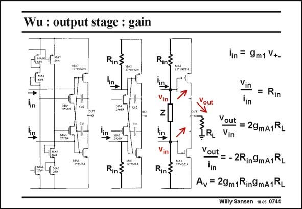

# SANSEN-0744 · Wu : output stage : gain

章节：07 常用运算放大器电路  
PDF 页：228；书本页：233；幻灯片编号：0744  
状态：unreviewed



## 对应教材讲解

### PDF 228 · 书本 233

For high gain, the output impedance of the first stage or the Gates of the output transistors have to be at very high impedance. It may not appear like that because these nodes are connected to two Sources, of transistors MA3 and MA4. Sources suggest impedance levels of 1/g . This is not the case m here however, as shown next. The output stage is repeated three times. The first one is simply copied from the overall circuit diagram. In the second one, the output resistance of the first stage is represented by R . In the third one, the two transistors in parallel are substituted by an in impedance called Z. It is now easy to calculate the gain of this amplifier. The input stage provides a conversion of g . The total gain also includes the transconductance of the output devices g . Impedance Z m1 mA1 is not part of it. The reason is that the impedance Z is bootstrapped out. We see on the third diagram, that the currents coming from the input stage have the same phase and therefore drive the output transistors with the same phase as well. This is typical for a class-AB stage. Both transistors have to be driven in phase to turn one output transistor and the other one off. As a result, the voltages at the Gates of the output devices are nearly the same in amplitude. No AC voltage appears across the impedance Z. It does not carry any AC current. It looks like an infinite impedance and it is bootstrapped out.

## 公式／性能结论候选摘录

以下为规则截取的原文，尚未逐项判读。

- PDF 228: For high gain, the output impedance of the first stage or the Gates of the output transistors have to be at very high impedance.
- PDF 228: It is now easy to calculate the gain of this amplifier.
- PDF 228: The total gain also includes the transconductance of the output devices g .
- PDF 228: We see on the third diagram, that the currents coming from the input stage have the same phase and therefore drive the output transistors with the same phase as well.
- PDF 228: As a result, the voltages at the Gates of the output devices are nearly the same in amplitude.

## 曲线结论候选摘录

以下为规则截取的原文，尚未逐项判读。

- PDF 228: We see on the third diagram, that the currents coming from the input stage have the same phase and therefore drive the output transistors with the same phase as well.
- PDF 228: Both transistors have to be driven in phase to turn one output transistor and the other one off.

## 原文条件与近似候选摘录

以下为规则截取的原文，尚未逐项判读。

（未由规则找到；不代表原页没有此类内容。）

## 幻灯片 OCR（未校正）

```text
Wu : output stage : gain
Rin3
Rins
lin
lin
Rin
lin
Vin
Rin}
lin = 9m1 V+-
Vin
Rin
Vout
Yout = 29mA1RL
RL Vin
Vout
=- 2R:9mA1RL
lin
Av = 29m1Rin9mA1RL
Willy Sansen 1005 0744
```

数学上下标、分数及正负号以原图为准。电路图已保留；未核对的连接不输出成可仿真 netlist。
