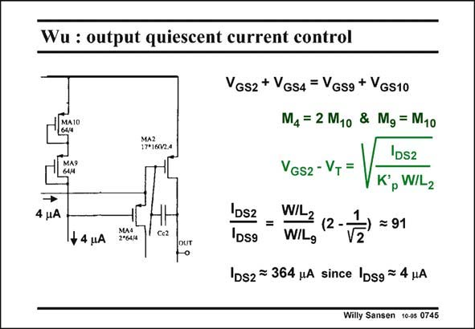

# SANSEN-0745 · Wu : output quiescent current control

章节：07 常用运算放大器电路  
PDF 页：228；书本页：233；幻灯片编号：0745  
状态：unreviewed



## 对应教材讲解

### PDF 228 · 书本 233

What is the purpose then of these two transistors MA3 and MA4 when they do not play a role for the gain? They are there to set the quiescent current in the output transistors. The output transistor MA2 forms with transistor MA4 a translinear loop with transistors MA9 and MA10. The sum of their V ’s are GS the same as spelled out in this slide. The DC currents in three of these four devices are con-

### PDF 229 · 书本 234

stant and set by DC current sources to be 4 –5 mA. As a result, the DC current through the forth one (MA2) is also set to be constant. All four transistors have the same V and K∞ . The ratio of the DC current through output T p transistor MA2 is now about 100 times the current in MA4. This is an easy way of controling the DC current in a class-AB stage, as will be explained in more detail in Chapter 12.

## 公式／性能结论候选摘录

以下为规则截取的原文，尚未逐项判读。

- PDF 228: What is the purpose then of these two transistors MA3 and MA4 when they do not play a role for the gain?
- PDF 229: As a result, the DC current through the forth one (MA2) is also set to be constant.

## 曲线结论候选摘录

以下为规则截取的原文，尚未逐项判读。

（未由规则找到；不代表原页没有此类内容。）

## 原文条件与近似候选摘录

以下为规则截取的原文，尚未逐项判读。

（未由规则找到；不代表原页没有此类内容。）

## 幻灯片 OCR（未校正）

```text
Wu : output quiescent current control
17*160/2.4
4 uA
+ 4 uA
MAS
2°64/4
Ce2
OUT
VGs2 + VGS4 = Vgsg + VGS10
M4 = 2 M1o & Mg = M10
DS2
VGS2 - VT =
K°, W/Lz
DS2
DS9
WIL2
W/Lg
2
= 91
IDs2 = 364 uA since IDsg = 4 HA
Willy Sansen 10-05 0745
```

数学上下标、分数及正负号以原图为准。电路图已保留；未核对的连接不输出成可仿真 netlist。
