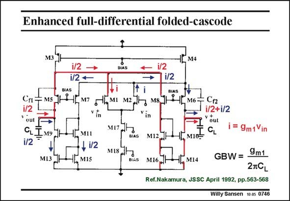

# SANSEN-0746 · Enhanced full-differential folded-cascode

章节：07 常用运算放大器电路  
PDF 页：229；书本页：234；幻灯片编号：0746  
状态：unreviewed



## 对应教材讲解

### PDF 229 · 书本 234

An even more symmetrical folded cascode OTA than the folded cascode OTA is shown in this slide. The Drain of each input transistor sees exactly the same impedance, even at the highest frequencies. At each Drain the circular current i is split up in two equal parts i/2. One part goes directly to the output, whereas the other is mirrored first. Because of this perfect matching at high frequencies, this amplifier has a perfect cancellation of higher order poles and zeros. As a result, it has a much higher CMRR. Moreover, the Slew Rate is perfectly symmetrical. It is therefore an ideal building block for higher frequencies.

## 公式／性能结论候选摘录

以下为规则截取的原文，尚未逐项判读。

- PDF 229: At each Drain the circular current i is split up in two equal parts i/2.
- PDF 229: As a result, it has a much higher CMRR.
- PDF 229: It is therefore an ideal building block for higher frequencies.

## 曲线结论候选摘录

以下为规则截取的原文，尚未逐项判读。

（未由规则找到；不代表原页没有此类内容。）

## 原文条件与近似候选摘录

以下为规则截取的原文，尚未逐项判读。

（未由规则找到；不代表原页没有此类内容。）

## 幻灯片 OCR（未校正）

```text
Enhanced full-differential folded-cascode
M4
i/2
i/2 +
BIAS
BIAS
i/2
BIAS
Ca:
MSI
i/2
out
CL]M9
i/2
M8.]
LM6'
C12
1/2+1/2
out
MI3
- i/2
M15
MIS
M12
M10-
i= 9m1Vin
Ml6.
M14
GBW= 9m1
2TCL
Ref.Nakamura, JSSC April 1992, pp.563-568
Willy Sansen 10-05 0746
```

数学上下标、分数及正负号以原图为准。电路图已保留；未核对的连接不输出成可仿真 netlist。
