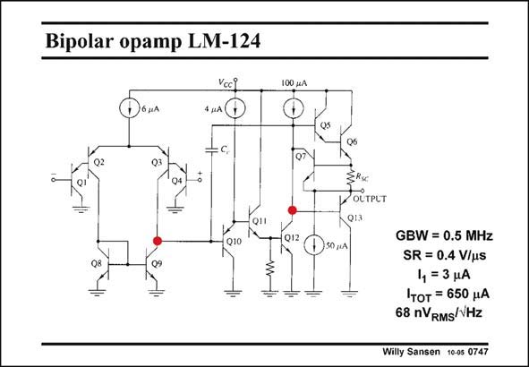

# SANSEN-0747 · Bipolar opamp LM-124

章节：07 常用运算放大器电路  
PDF 页：229；书本页：234；幻灯片编号：0747  
状态：unreviewed



## 对应教材讲解

### PDF 229 · 书本 234

Another bipolar opamp is also capable of taking input voltages below ground. Remember that this is an advantage of a folded cascode. This input differential pair is preceded by two Emitter followers. As a result the inputs can go below ground. For V ’s of BE 0.6 V, and V ’s of 0.1 V, we CE see that the inputs can go 0.5 V below ground. This is an opamp which is suited very well for singlesupply applications such as most of the automotive applications, etc.

### PDF 230 · 书本 235

Moreover, this opamp takes very little power. As a consequence, the GBW is fairly low. The noise is very high, however. The reasons are that the currents are small but especially that emitter followers are used at the input. They do not give voltage gain. As a result, all six transistors of the input stage contribute to the equivalent input noise.

## 公式／性能结论候选摘录

以下为规则截取的原文，尚未逐项判读。

- PDF 229: As a result the inputs can go below ground.
- PDF 230: They do not give voltage gain.
- PDF 230: As a result, all six transistors of the input stage contribute to the equivalent input noise.

## 曲线结论候选摘录

以下为规则截取的原文，尚未逐项判读。

（未由规则找到；不代表原页没有此类内容。）

## 原文条件与近似候选摘录

以下为规则截取的原文，尚未逐项判读。

（未由规则找到；不代表原页没有此类内容。）

## 幻灯片 OCR（未校正）

```text
Bipolar opamp LM-124
Voci
4 HA D
100 p.A
010
Q12
ERse
POLTPLT
Q13
DSO,A
Q9
GBW = 0.5 MHz
SR = 0.4 V/us
1, = 3 4A
Iтот = 650 рA
68 nVRMS/VHz
Willy Sansen 10-05 0747
```

数学上下标、分数及正负号以原图为准。电路图已保留；未核对的连接不输出成可仿真 netlist。
