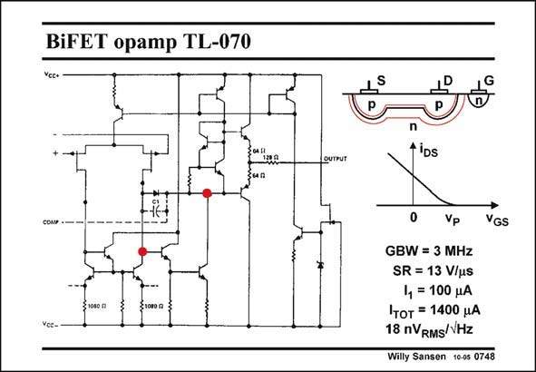

# SANSEN-0748 · BiFET opamp TL-070

章节：07 常用运算放大器电路  
PDF 页：230；书本页：235；幻灯片编号：0748  
状态：unreviewed



## 对应教材讲解

### PDF 230 · 书本 235

A two-stage bipolar opamp with JFETs at the input is shown in this slide. JFETs behave as MOSTs but with larger input currents. Actually, their input currents are leakage currents, because of the reverse biased input pn junctions. They are much smaller than for bipolar transistors though. Also, their threshold voltages are negative. They are depletion devices rather than enhancement devices such as MOSTs. They conduct at zero V . Also, their threshold voltage, called pinch-off voltage V , is usually GS P several Volts. These p-channel JFETs substitute the pnp transistors which were originally in this circuit. After all, this is just a two-stage operational amplifier with Miller compensation. With bipolar transistors at the input however, the Slew Rate is too small. JFETs have been used instead to increase the Slew Rate. They also give very little 1/f noise, which is an additional advantage for low-frequency circuits such as high-performance audio amplifiers.

## 公式／性能结论候选摘录

以下为规则截取的原文，尚未逐项判读。

- PDF 230: JFETs have been used instead to increase the Slew Rate.

## 曲线结论候选摘录

以下为规则截取的原文，尚未逐项判读。

（未由规则找到；不代表原页没有此类内容。）

## 原文条件与近似候选摘录

以下为规则截取的原文，尚未逐项判读。

- PDF 230: They are much smaller than for bipolar transistors though.

## 幻灯片 OCR（未校正）

```text
BiFET opamp TL-070
OUTPUT
coNe
S1OвО я
*IDs
0
Vp
VGS
GBW = 3 MHz
SR = 13 V/us
14 = 100 MA
Iтот = 1400 uA
18 nVRMS/VHz
Willy Sansen 1005 0748
```

数学上下标、分数及正负号以原图为准。电路图已保留；未核对的连接不输出成可仿真 netlist。
