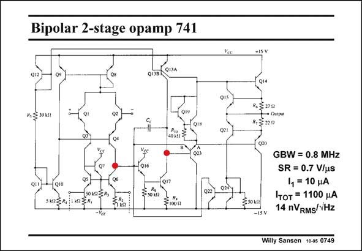

# SANSEN-0749 · Bipolar 2-stage opamp 741

章节：07 常用运算放大器电路  
PDF 页：230；书本页：235；幻灯片编号：0749  
状态：unreviewed



## 对应教材讲解

### PDF 230 · 书本 235

This is a two-stage opamp which has been the workhorse for all discrete analog electronics over decades of years. The only difference with any two-stage Miller compensated opamp is the input stage. Lateral pnp transistors have a low beta and cannot be used as input transistors. On the other hand, we definitely want to use highspeed npn transistors in the second stage to shift the

### PDF 231 · 书本 236

non-dominant pole to high frequencies. As a result, the current mirror in the input stage must be realized by means of npn devices as well. This is why non transistors are used at the input. They give small input base currents. These input npn’s are now put in series with lateral pnp’s, to be able to drive the npn current mirror. Since all input transistors carry the same current, they all have the same transconductance. The input transconductance is now reduced by two to g /2. This is only a small loss. m1 The pnp transistors in the input stage are biased by a common-mode feedback loop. Indeed, this loop is closed over the input devices and the current mirror Q8/Q9. This loop desensitizes the DC currents of the input devices from the pnp beta’s. However, the performance of this bipolar opamp is rather moderate.

## 公式／性能结论候选摘录

以下为规则截取的原文，尚未逐项判读。

- PDF 231: As a result, the current mirror in the input stage must be realized by means of npn devices as well.

## 曲线结论候选摘录

以下为规则截取的原文，尚未逐项判读。

（未由规则找到；不代表原页没有此类内容。）

## 原文条件与近似候选摘录

以下为规则截取的原文，尚未逐项判读。

（未由规则找到；不代表原页没有此类内容。）

## 幻灯片 OCR（未校正）

```text
Bipolar 2-stage opamp 741
R, 273
→ Оuдрuя
R,320
3122
GBW = 0.8 MHz
SR = 0.7 V/us
1, = 10 MA
Iтот = 1100 uA
ISv
14 nVRMS/VHz
Willy Sansen 10-05 0749
```

数学上下标、分数及正负号以原图为准。电路图已保留；未核对的连接不输出成可仿真 netlist。
