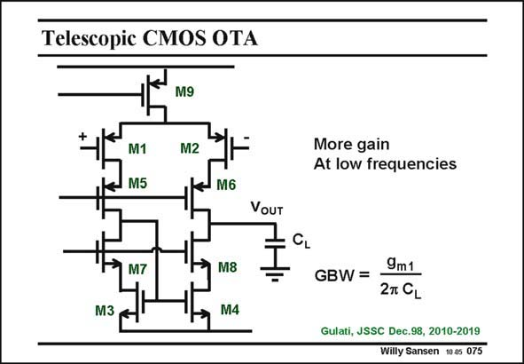

# SANSEN-075 · Telescopic CMOS OTA

章节：07 常用运算放大器电路  
PDF 页：208；书本页：213；幻灯片编号：075  
状态：unreviewed



## 对应教材讲解

### PDF 208 · 书本 213

The gain of such a voltage amplifier is rather limited as the gain per transistor can be quite small for nanometer MOST devices. This is why cascodes are better added. Four cascode MOSTs are added M5–8 in series with the input devices and current mirror, as shown in this slide. Note that cascode M7 is included in the feedback loop around transistor M3, which allows a larger output swing. This is called the telescopic CMOS OTA. The impedance at the output node increases considerably, but not the GBW, as shown next. Obviously the power consumption does not increase.

## 公式／性能结论候选摘录

以下为规则截取的原文，尚未逐项判读。

- PDF 208: The gain of such a voltage amplifier is rather limited as the gain per transistor can be quite small for nanometer MOST devices.
- PDF 208: The impedance at the output node increases considerably, but not the GBW, as shown next.
- PDF 208: Obviously the power consumption does not increase.

## 曲线结论候选摘录

以下为规则截取的原文，尚未逐项判读。

（未由规则找到；不代表原页没有此类内容。）

## 原文条件与近似候选摘录

以下为规则截取的原文，尚未逐项判读。

（未由规则找到；不代表原页没有此类内容。）

## 幻灯片 OCR（未校正）

```text
Telescopic CMOS OTA
M9
M1
JMS
M2
More gain
At low frequencies
M6
VOUT
CL
M7
M3
M8
M4
GBW =
9m1
27 CL
Gulati, JSSC Dec.98, 2010-2019
Willy Sansen 10.a5 075
```

数学上下标、分数及正负号以原图为准。电路图已保留；未核对的连接不输出成可仿真 netlist。
