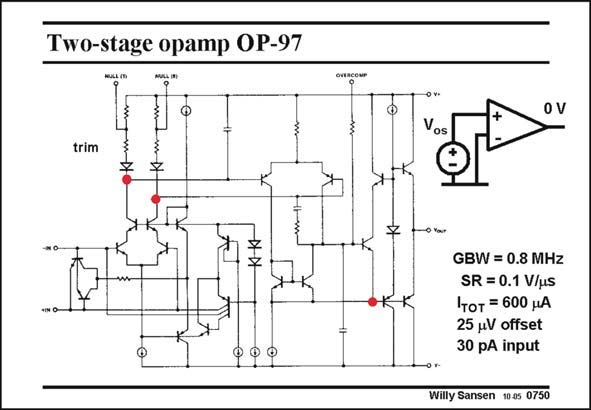

# SANSEN-0750 · Two-stage opamp OP-97

章节：07 常用运算放大器电路  
PDF 页：231；书本页：236；幻灯片编号：0750  
状态：unreviewed



## 对应教材讲解

### PDF 231 · 书本 236

A high performance bipolar opamp is shown in this slide. It is again a two-stage opamp as suggested by the red dots. Its GBW is moderate but its gain is very high. Its offset is trimmed to very low values. This is achieved by using resistive loads in the first stage. These resistors can be trimmed by laser or other techniques, to very small values, improving the Common-mode Rejection Ratio considerably (see Chapter 15). The resistors in the input stage are not as good as active loads, however. They lead to lower gain. This is why a second stage is used with very high gain. This second stage consists of a differential voltage amplifier, to which an emitter follower has been added, as explained next.

## 公式／性能结论候选摘录

以下为规则截取的原文，尚未逐项判读。

- PDF 231: Its GBW is moderate but its gain is very high.
- PDF 231: They lead to lower gain.
- PDF 231: This is why a second stage is used with very high gain.

## 曲线结论候选摘录

以下为规则截取的原文，尚未逐项判读。

（未由规则找到；不代表原页没有此类内容。）

## 原文条件与近似候选摘录

以下为规则截取的原文，尚未逐项判读。

（未由规则找到；不代表原页没有此类内容。）

## 幻灯片 OCR（未校正）

```text
Two-stage opamp OP-97
trim
00 0
Vos
GBW = 0.8 MHz
SR = 0.1 V/uS
Iтот = 600 нA
25 uV offset
30 pA input
Willy Sansen 10.05 0750
```

数学上下标、分数及正负号以原图为准。电路图已保留；未核对的连接不输出成可仿真 netlist。
