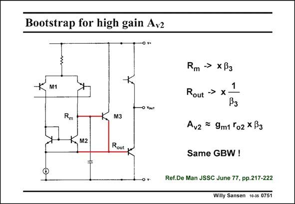

# SANSEN-0751 · Bootstrap for high gain Avz

章节：07 常用运算放大器电路  
PDF 页：232；书本页：237；幻灯片编号：0751  
状态：unreviewed



## 对应教材讲解

### PDF 231 · 书本 236

The second stage of this amplifier is taken separately. It consists indeed of a differential voltage amplifier, to which an Emitter follower has been added, as shown in this slide. This Emitter follower M3 bootstraps out the output resistor r of transistor M2. As a result, o2 only the output resistance of the input pnp plays a role for the gain. They are lateral devices in which the output resistance can be made as large as needed. Moreover, the output impedance R will also be smaller. out

### PDF 232 · 书本 237

An accurate analysis shows that the gain is actually multiplied by the beta b of transistor M3. 3 This is an attractive technique to boost the gain. Since the gain becomes smaller for smaller channel lengths, all possible gainboosting techniques will become necessary. Bootstrapping resistances to high values is certainly among them.

## 公式／性能结论候选摘录

以下为规则截取的原文，尚未逐项判读。

- PDF 231: As a result, o2 only the output resistance of the input pnp plays a role for the gain.
- PDF 232: An accurate analysis shows that the gain is actually multiplied by the beta b of transistor M3. 3 This is an attractive technique to boost the gain.
- PDF 232: Since the gain becomes smaller for smaller channel lengths, all possible gainboosting techniques will become necessary.

## 曲线结论候选摘录

以下为规则截取的原文，尚未逐项判读。

（未由规则找到；不代表原页没有此类内容。）

## 原文条件与近似候选摘录

以下为规则截取的原文，尚未逐项判读。

（未由规则找到；不代表原页没有此类内容。）

## 幻灯片 OCR（未校正）

```text
Bootstrap for high gain Avz
-0 v+
M1
Rm →> xB3
Rout →> x
1
M3
Avz = 9m1 °o2 x B3
M2
Rout
Same GBW !
Ref.De Man JSSC June 77, pp.217-222
Willy Sansen 10-05 0751
```

数学上下标、分数及正负号以原图为准。电路图已保留；未核对的连接不输出成可仿真 netlist。
