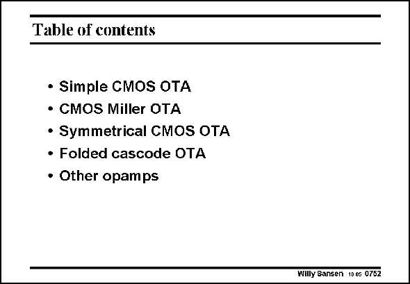

# SANSEN-0752 · Table of contents

章节：07 常用运算放大器电路  
PDF 页：232；书本页：237；幻灯片编号：0752  
状态：unreviewed



## 对应教材讲解

### PDF 232 · 书本 237

In this Chapter, a wide variety of possible operational amplifiers have been discussed. Most design effort has gone to the symmetrical amplifier and the folded cascode. However, most of them have a single-ended output. They cannot be used in a mixed-signal environment. For this purpose, they must be fully differential. They must have two outputs, as introduced in the next Chapter.

## 公式／性能结论候选摘录

以下为规则截取的原文，尚未逐项判读。

（未由规则找到；不代表原页没有此类内容。）

## 曲线结论候选摘录

以下为规则截取的原文，尚未逐项判读。

（未由规则找到；不代表原页没有此类内容。）

## 原文条件与近似候选摘录

以下为规则截取的原文，尚未逐项判读。

（未由规则找到；不代表原页没有此类内容。）

## 幻灯片 OCR（未校正）

```text
Table of contents
• Simple CMOS OTA
• CMOS Miller OTA
• Symmetrical CMOS OTA
• Folded cascode OTA
• Other opamps
Willy Sansen 10€5 0752
```

数学上下标、分数及正负号以原图为准。电路图已保留；未核对的连接不输出成可仿真 netlist。
