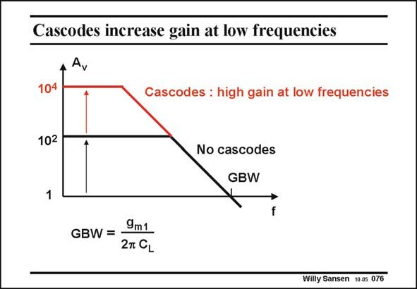

# SANSEN-076 · Cascodes increase gain at low frequencies

章节：07 常用运算放大器电路  
PDF 页：208；书本页：213；幻灯片编号：076  
状态：unreviewed



## 对应教材讲解

### PDF 208 · 书本 213

Without cascodes, the gain is moderate. With cascodes however, the gain is increased, but only at low frequencies. Cascode transistors are now mainly used for more gain at low frequencies, for example for lower distortion at low frequencies. Another ‘‘hat’’ can be put on top of this characteristic by application of gain boosting to the cascode transistors M6 and M8. For deep submicron or nanometer CMOS this has always become a necessity, as the gain per transistor has become less than 10.

## 公式／性能结论候选摘录

以下为规则截取的原文，尚未逐项判读。

- PDF 208: Without cascodes, the gain is moderate.
- PDF 208: With cascodes however, the gain is increased, but only at low frequencies.
- PDF 208: Cascode transistors are now mainly used for more gain at low frequencies, for example for lower distortion at low frequencies.
- PDF 208: Another ‘‘hat’’ can be put on top of this characteristic by application of gain boosting to the cascode transistors M6 and M8.
- PDF 208: For deep submicron or nanometer CMOS this has always become a necessity, as the gain per transistor has become less than 10.

## 曲线结论候选摘录

以下为规则截取的原文，尚未逐项判读。

- PDF 208: Another ‘‘hat’’ can be put on top of this characteristic by application of gain boosting to the cascode transistors M6 and M8.

## 原文条件与近似候选摘录

以下为规则截取的原文，尚未逐项判读。

（未由规则找到；不代表原页没有此类内容。）

## 幻灯片 OCR（未校正）

```text
Cascodes increase gain at low frequencies
→
Ay
104
Cascodes : high gain at low frequencies
102
+
No cascodes
GBW
1
GBW = •
9m1
2T CL
Willy Sansen 10.05 076
```

数学上下标、分数及正负号以原图为准。电路图已保留；未核对的连接不输出成可仿真 netlist。
