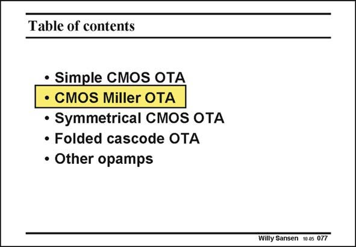

# SANSEN-077 · Table of contents

章节：07 常用运算放大器电路  
PDF 页：209；书本页：214；幻灯片编号：077  
状态：unreviewed



## 对应教材讲解

### PDF 209 · 书本 214

A two-stage amplifier such as the CMOS Miller OTA needs more power to reach similar values of GBW, compared to a single-stage amplifier. BiCMOS can now be considered to save power. The design plans have been previously discussed. They will be applied.

## 公式／性能结论候选摘录

以下为规则截取的原文，尚未逐项判读。

（未由规则找到；不代表原页没有此类内容。）

## 曲线结论候选摘录

以下为规则截取的原文，尚未逐项判读。

（未由规则找到；不代表原页没有此类内容。）

## 原文条件与近似候选摘录

以下为规则截取的原文，尚未逐项判读。

（未由规则找到；不代表原页没有此类内容。）

## 幻灯片 OCR（未校正）

```text
Table of contents
• Simple CMOS OTA
• CMOS Miller OTA
• Symmetrical CMOS OTA
• Folded cascode OTA
• Other opamps
Willy Sansen 10.05 077
```

数学上下标、分数及正负号以原图为准。电路图已保留；未核对的连接不输出成可仿真 netlist。
