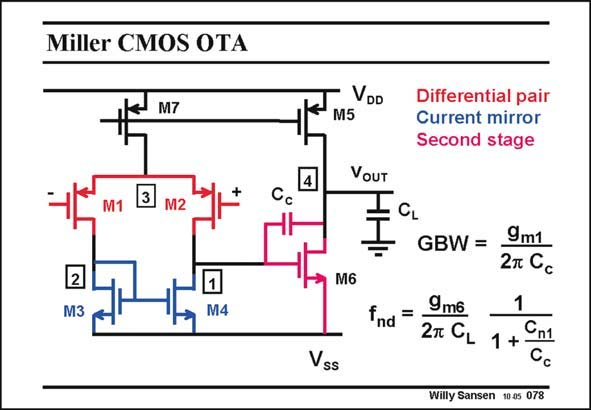

# SANSEN-078 · Miller CMOS OTA

章节：07 常用运算放大器电路  
PDF 页：209；书本页：214；幻灯片编号：078  
状态：unreviewed



## 对应教材讲解

### PDF 209 · 书本 214

A Miller OTA in CMOS technologies has been discussed in great detail. The two governing expressions are listed for the last time. They are dealing with the GBW and with the nondominant pole. In each design plan, it is always better to start with the highest frequencies first, which here is the non-dominant pole. Decisions about g and m6 C are always first, as c explained before.

## 公式／性能结论候选摘录

以下为规则截取的原文，尚未逐项判读。

（未由规则找到；不代表原页没有此类内容。）

## 曲线结论候选摘录

以下为规则截取的原文，尚未逐项判读。

（未由规则找到；不代表原页没有此类内容。）

## 原文条件与近似候选摘录

以下为规则截取的原文，尚未逐项判读。

（未由规则找到；不代表原页没有此类内容。）

## 幻灯片 OCR（未校正）

```text
Miller CMOS OTA
M7
VDD
M5
Differential pair
Current mirror
Second stage
VOUT
Cc
2
M3
M6
M4
Vss
GBW =
9m1
2т Cc
Ind=
9 mб
1
2T CL
1 + Cn1
Cc
Willy Sansen 1005 078
```

数学上下标、分数及正负号以原图为准。电路图已保留；未核对的连接不输出成可仿真 netlist。
