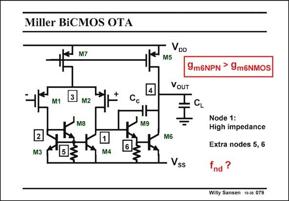

# SANSEN-079 · Miller BiCMOS OTA

章节：07 常用运算放大器电路  
PDF 页：210；书本页：215；幻灯片编号：079  
状态：unreviewed



## 对应教材讲解

### PDF 209 · 书本 214

Can BiCMOS provide additional advantages? A typical BiCMOS realization of a Miller OTA is shown in this slide. The second stage uses a bipolar transistor as its g is the same as for a MOST but with 4 m times less DC current. Since the current in the second stage is by far the larger one, big savings in power consumption are achieved. The input resistance of a bipolar transistor is too small, however. It reduces the resistance at node 1 considerably, such that there is little gain left (if any) in the first stage.

### PDF 210 · 书本 215

This is why we need an Emitter follower between the first stage and the input transistor of the second stage. It is realized with transistor M9. The input resistance is now beta times higher and hopefully comparable to the output resistance of the first stage. This Emitter follower raises the DC voltage at node 1 by one more V . As BE a result, node 1 is about 2 V ’s or 1.3 V higher than BE V . SS In order to establish the same DC voltage at the other node 2, we use the three-transistor bipolar current mirror, explained in Chapter 2. Now both nodes 1 and 2 present similar DC voltages to the input pair, improving matching.

## 公式／性能结论候选摘录

以下为规则截取的原文，尚未逐项判读。

- PDF 209: It reduces the resistance at node 1 considerably, such that there is little gain left (if any) in the first stage.

## 曲线结论候选摘录

以下为规则截取的原文，尚未逐项判读。

（未由规则找到；不代表原页没有此类内容。）

## 原文条件与近似候选摘录

以下为规则截取的原文，尚未逐项判读。

（未由规则找到；不代表原页没有此类内容。）

## 幻灯片 OCR（未校正）

```text
Miller BiCMOS OTA
M7
3
M1
M2
Cc
M8
M9
2
М3
M4
VDD
M5
9m6NPN > 9m6NMOS
VOUT
M6
Node 1:
High impedance
Extra nodes 5, 6
Vss
Willy Sansen 10-05 079
```

数学上下标、分数及正负号以原图为准。电路图已保留；未核对的连接不输出成可仿真 netlist。
