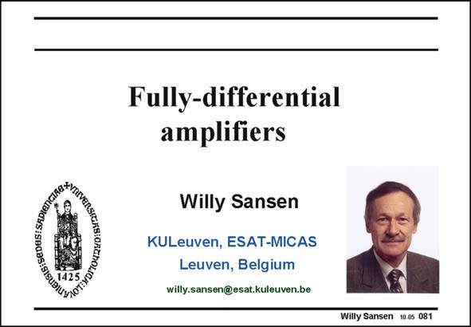

# SANSEN-081 · Slide 081

章节：08 全差分放大器  
PDF 页：233；书本页：239；幻灯片编号：081  
状态：unreviewed



## 对应教材讲解

### PDF 233 · 书本 239

Fully-differential circuits have two differential outputs. They need them to be able to reject the commonmode disturbances generated by the digital circuits, the class-AB drivers, the clock drivers, etc. As a consequence, all mixed-signal circuitry requires the amplifiers to be fully-differential. However, his will cost a lot of additional power consumption. Consequently, an extra amplifier will be required to stabilize the average or common-mode output level. It is called the common-mode feedback (CMFB) amplifier. It obviously takes additional current. One of the most important specifications will therefore be at which extra current an amplifier can be made fully-differential.

## 公式／性能结论候选摘录

以下为规则截取的原文，尚未逐项判读。

- PDF 233: One of the most important specifications will therefore be at which extra current an amplifier can be made fully-differential.

## 曲线结论候选摘录

以下为规则截取的原文，尚未逐项判读。

（未由规则找到；不代表原页没有此类内容。）

## 原文条件与近似候选摘录

以下为规则截取的原文，尚未逐项判读。

（未由规则找到；不代表原页没有此类内容。）

## 幻灯片 OCR（未校正）

```text
GNG:SEDESI SADIATG
Fully-differential
amplifiers
Willy Sansen
KULeuven, ESAT-MICAS
Leuven, Belgium
willy.sansen@esat.kuleuven.be
Willy Sansen 10.05 081
```

数学上下标、分数及正负号以原图为准。电路图已保留；未核对的连接不输出成可仿真 netlist。
