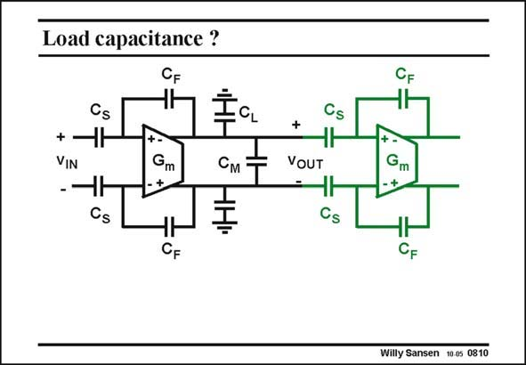

# SANSEN-0810 · Load capacitance ?

章节：08 全差分放大器  
PDF 页：237；书本页：243；幻灯片编号：0810  
状态：unreviewed



## 对应教材讲解

### PDF 237 · 书本 243

The differential and common-mode amplifiers don’t necessarily have the same load capacitances. A situation is sketched in this slide where we have two consecutive fully-differential amplifiers. Both are using differential feedback to set the gain and the bandwidth. The capacitances C are L parasitic capacitances to ground. They obviously depend on the length and nature of the interconnect. Capacitance C is a mutual M capacitance. Now both the differential and common-mode load capacitances are derived.

## 公式／性能结论候选摘录

以下为规则截取的原文，尚未逐项判读。

- PDF 237: Both are using differential feedback to set the gain and the bandwidth.
- PDF 237: They obviously depend on the length and nature of the interconnect.

## 曲线结论候选摘录

以下为规则截取的原文，尚未逐项判读。

（未由规则找到；不代表原页没有此类内容。）

## 原文条件与近似候选摘录

以下为规则截取的原文，尚未逐项判读。

（未由规则找到；不代表原页没有此类内容。）

## 幻灯片 OCR（未校正）

```text
Load capacitance ?
+
VIN
Gm
См
Cs
CF
CF
+
VOUT
Cs
Cs
Gm
CF
Willy Sansen 100s 0810
```

数学上下标、分数及正负号以原图为准。电路图已保留；未核对的连接不输出成可仿真 netlist。
