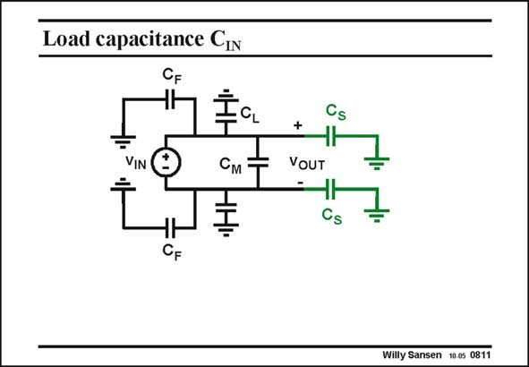

# SANSEN-0811 · Load capacitance CIn

章节：08 全差分放大器  
PDF 页：238；书本页：244；幻灯片编号：0811  
状态：unreviewed



## 对应教材讲解

### PDF 238 · 书本 244

All the capacitances which are present at the output terminals of one amplifier are sketched in this slide. The input capacitances of the next amplifier are included as well. The virtual grounds are taken as real grounds. An input voltage is added to measure the total capacitance at the outputs. It will be a differential input voltage to find the differential load capacitance, but a common-mode input voltage for the load capacitance of the CMFB amplifier.

## 公式／性能结论候选摘录

以下为规则截取的原文，尚未逐项判读。

（未由规则找到；不代表原页没有此类内容。）

## 曲线结论候选摘录

以下为规则截取的原文，尚未逐项判读。

（未由规则找到；不代表原页没有此类内容。）

## 原文条件与近似候选摘录

以下为规则截取的原文，尚未逐项判读。

（未由规则找到；不代表原页没有此类内容。）

## 幻灯片 OCR（未校正）

```text
Load capacitance CIn
См
CF
+
VOUT
Cs
Willy Sansen 10.0s 0811
```

数学上下标、分数及正负号以原图为准。电路图已保留；未核对的连接不输出成可仿真 netlist。
