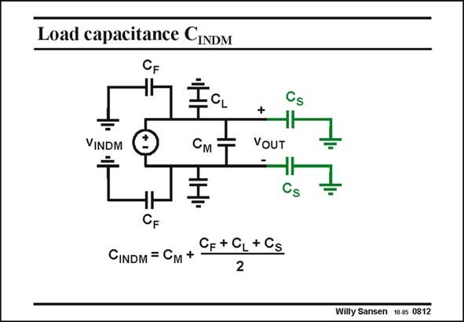

# SANSEN-0812 · Load capacitance CINDM

章节：08 全差分放大器  
PDF 页：238；书本页：244；幻灯片编号：0812  
状态：unreviewed



## 对应教材讲解

### PDF 238 · 书本 244

For differential operation, the differential input voltage sees a load capacitance C , as indicated in this INDM slide. The differential load capacitance is quite small. It only contains the mutual capacitance and half of all the others.

## 公式／性能结论候选摘录

以下为规则截取的原文，尚未逐项判读。

（未由规则找到；不代表原页没有此类内容。）

## 曲线结论候选摘录

以下为规则截取的原文，尚未逐项判读。

（未由规则找到；不代表原页没有此类内容。）

## 原文条件与近似候选摘录

以下为规则截取的原文，尚未逐项判读。

（未由规则找到；不代表原页没有此类内容。）

## 幻灯片 OCR（未校正）

```text
Load capacitance CINDM
VINDM
См
+
VOUT
Cs
Cs
CF+CL+CS
CINDM = Cм +
2
Willy Sansen 10.0s 0812
```

数学上下标、分数及正负号以原图为准。电路图已保留；未核对的连接不输出成可仿真 netlist。
