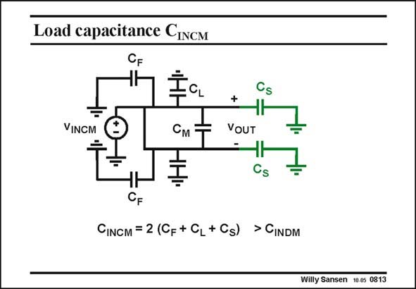

# SANSEN-0813 · Load capacitance CINCM

章节：08 全差分放大器  
PDF 页：239；书本页：245；幻灯片编号：0813  
状态：unreviewed



## 对应教材讲解

### PDF 239 · 书本 245

For common-mode operation, the common-mode input voltage sees a load capacitance C , which is INCM a lot larger. The feedback capacitors C and also the sampling F capacitors C are all S doubled. The CMFB amplifier has to drive larger load capacitances than the differential one. Moreover, it is always connected in unity gain, for which stability is harder to achieve. These are two reasons for trying to reduce the power consumption as much as possible.

## 公式／性能结论候选摘录

以下为规则截取的原文，尚未逐项判读。

- PDF 239: Moreover, it is always connected in unity gain, for which stability is harder to achieve.

## 曲线结论候选摘录

以下为规则截取的原文，尚未逐项判读。

（未由规则找到；不代表原页没有此类内容。）

## 原文条件与近似候选摘录

以下为规则截取的原文，尚未逐项判读。

（未由规则找到；不代表原页没有此类内容。）

## 幻灯片 OCR（未校正）

```text
Load capacitance CINCM
VINGM
См
+
VOUT
Cs
Cs
CF
CINGM = 2 (CF + CL+Cs) > CINDM
Willy Sansen 10.05 0813
```

数学上下标、分数及正负号以原图为准。电路图已保留；未核对的连接不输出成可仿真 netlist。
