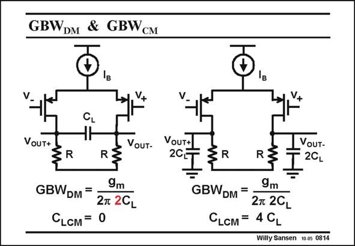

# SANSEN-0814 · GBWDM & GBWeM

章节：08 全差分放大器  
PDF 页：239；书本页：245；幻灯片编号：0814  
状态：unreviewed



## 对应教材讲解

### PDF 239 · 书本 245

Even with the simplest, single-stage, fully-differential amplifier, we have to be careful with the definition of the load capacitance. After all, this load capacitance determines the GBW! With a floating capacitance (at the left) we have to include this capacitance twice in the differential GBW . Moreover there DM is no common-mode load capacitance! Its GBW CM would therefore be infinity. With two capacitors to ground, the situation is very different. The differential load capacitance is smaller; it is C itself. L The common-mode load capacitance is not at zero. It is twice C ! L

## 公式／性能结论候选摘录

以下为规则截取的原文，尚未逐项判读。

- PDF 239: Its GBW CM would therefore be infinity.

## 曲线结论候选摘录

以下为规则截取的原文，尚未逐项判读。

（未由规则找到；不代表原页没有此类内容。）

## 原文条件与近似候选摘录

以下为规则截取的原文，尚未逐项判读。

（未由规则找到；不代表原页没有此类内容。）

## 幻灯片 OCR（未校正）

```text
GBWDM & GBWeM
CL
ЧF
VouT+
VoUT-
R
9m
GBWDM =
2n 2CL
CLсM = 0
VoUT+
20T
IVouт-
T20L
GBWDM =
9m
2T 2GL
CLCM = 4 CL
Willy Sansen 100s 0814
```

数学上下标、分数及正负号以原图为准。电路图已保留；未核对的连接不输出成可仿真 netlist。
