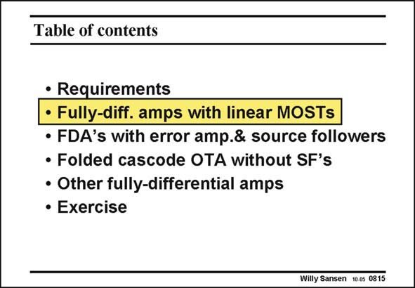

# SANSEN-0815 · Table of contents

章节：08 全差分放大器  
PDF 页：240；书本页：246；幻灯片编号：0815  
状态：unreviewed



## 对应教材讲解

### PDF 240 · 书本 246

Now that we know how to derive the specifications of a fully-differential amplifier, let us have a look at the three most used ones. The first one uses MOSTs in the linear region for the common-mode feedback.

## 公式／性能结论候选摘录

以下为规则截取的原文，尚未逐项判读。

（未由规则找到；不代表原页没有此类内容。）

## 曲线结论候选摘录

以下为规则截取的原文，尚未逐项判读。

（未由规则找到；不代表原页没有此类内容。）

## 原文条件与近似候选摘录

以下为规则截取的原文，尚未逐项判读。

（未由规则找到；不代表原页没有此类内容。）

## 幻灯片 OCR（未校正）

```text
Table of contents
• Requirements
• Fully-diff. amps with linear MOSTs
• FDA's with error amp.& source followers
• Folded cascode OTA without SF's
• Other fully-differential amps
• Exercise
Willy Sansen 10-0s 0815
```

数学上下标、分数及正负号以原图为准。电路图已保留；未核对的连接不输出成可仿真 netlist。
