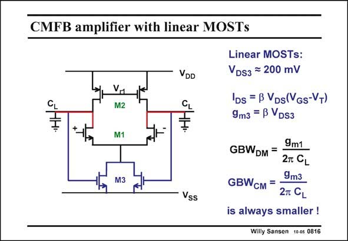

# SANSEN-0816 · CMFB amplifier with linear MOSTs

章节：08 全差分放大器  
PDF 页：240；书本页：246；幻灯片编号：0816  
状态：unreviewed



## 对应教材讲解

### PDF 240 · 书本 246

This is probably the simplest possible CMFB amplifier. It consists of a differential pair, the current source of which consists of two transistors M3 in the linear region, with a V < DS3 V −V . GS3 T The three functions of the CMFB amplifier are clearly distinguished. The output voltages are measured by the two transistors M3. Their Drains are connected to cancel the differential signal and the feedback loop is closed. Transistors M3 are thus the input devices of the CMFB amplifier. This is why their g is in m3 the expression of the GBW . CM The input transistors M1 of the differential pair function as cascodes for the CMFB. It is clear that in the linear region, the transconductances are much smaller than in the saturation region. The common-mode GBW is therefore smaller than the GBW . This is a CM DM disadvantage! Why do the transistors M3 operate in the linear region? There are two reasons. First of all, to have an output voltage in the middle, we need a large V . So as not to loose a large voltage drop, we need a small V . Clearly M3 must be in the GS3 DS3 linear region. The other reason is linearity. We need a linear cancellation of the differential signal to avoid the reduction of the differential gain because of the feedback. Transistors in the linear region are very linear indeed!

## 公式／性能结论候选摘录

以下为规则截取的原文，尚未逐项判读。

- PDF 240: Transistors M3 are thus the input devices of the CMFB amplifier.
- PDF 240: The common-mode GBW is therefore smaller than the GBW .
- PDF 240: We need a linear cancellation of the differential signal to avoid the reduction of the differential gain because of the feedback.

## 曲线结论候选摘录

以下为规则截取的原文，尚未逐项判读。

（未由规则找到；不代表原页没有此类内容。）

## 原文条件与近似候选摘录

以下为规则截取的原文，尚未逐项判读。

- PDF 240: It is clear that in the linear region, the transconductances are much smaller than in the saturation region.

## 幻灯片 OCR（未校正）

```text
CMFB amplifier with linear MOSTs
11
M2
M1
VDD
CL
÷
Vss
Linear MOSTs:
VDs3 = 200 mV
IDs = B VDs(VGs-VT)
9m3 = B VDs3
9m1
GBWDM =
2T CL
9m3
GBWCM = =
2л CL
is always smaller!
Willy Sansen 100s 0816
```

数学上下标、分数及正负号以原图为准。电路图已保留；未核对的连接不输出成可仿真 netlist。
