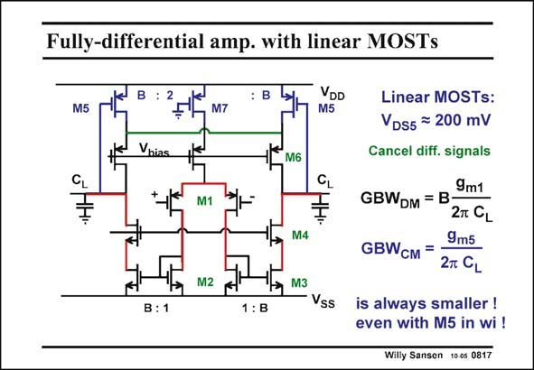

# SANSEN-0817 · Fully-differential amp. with linear MOSTs

章节：08 全差分放大器  
PDF 页：241；书本页：247；幻灯片编号：0817  
状态：unreviewed



## 对应教材讲解

### PDF 241 · 书本 247

Another fully-differential amplifier with CMFB is shown in this slide. The differential amplifier is a symmetrical amplifier, whereas the CMFB amplifier is the same as before. It uses transistors M5 in the linear region. Again, the outputs are measured. The differential signal is cancelled out with the (green) line and the loop is closed. Transistors M6 are cascodes in both amplifiers. Note that the independent biasing is taken care of by transistor M7 in the middle. It has a large V (half the total supply voltage) and a small V . GS7 DS7 By matching the transistors M5 to M7, the output voltages will be around zero. Assume then, that we have a B factor of three. Transistor M5 is then 50% larger than transistor M7. Its current is also 50% larger than in transistor M7. Their V voltages are the same because of DS cascodes M6. Their V values must also be the same. Since the Gate of M7 is connected to GS ground, the output voltages must also be around ground. Moreover, the output voltages are better defined (by matching) than in the previous circuit, where they depend on transistor sizes.

## 公式／性能结论候选摘录

以下为规则截取的原文，尚未逐项判读。

- PDF 241: Note that the independent biasing is taken care of by transistor M7 in the middle.
- PDF 241: Moreover, the output voltages are better defined (by matching) than in the previous circuit, where they depend on transistor sizes.

## 曲线结论候选摘录

以下为规则截取的原文，尚未逐项判读。

（未由规则找到；不代表原页没有此类内容。）

## 原文条件与近似候选摘录

以下为规则截取的原文，尚未逐项判读。

- PDF 241: Assume then, that we have a B factor of three.

## 幻灯片 OCR（未校正）

```text
Fully-differential amp. with linear MOSTs
M5
DD
M5
Vhias
M6
CL
M1
M4
M2
M3
Vss
B:1
1 : B
Linear MOSTs:
VDs5 = 200 mV
Cancel diff. signals
9m1
GBWDM = B
2T CL
9m5
GBWсM =
2T CL
is always smaller !
even with M5 in wi !
Willy Sansen 10 os 0817
```

数学上下标、分数及正负号以原图为准。电路图已保留；未核对的连接不输出成可仿真 netlist。
