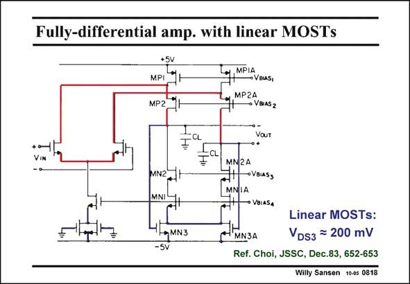

# SANSEN-0818 · Fully-differential amp. with linear MOSTs

章节：08 全差分放大器  
PDF 页：241；书本页：247；幻灯片编号：0818  
状态：unreviewed



## 对应教材讲解

### PDF 241 · 书本 247

The same CMFB amplifier can be applied to a folded cascode stage as well. Now we have a folded cascode OTA for the differential operation. The same CMFB amplifier is applied as before. Transistors MN3 operate in the linear region. They carry out the three functions again. The output voltages will be around 0 V because the transistors MN3 are matched to the two transistors in the current source at the input. Their Gates are connected to ground. The currents in all branches are the same. The V values are also the same. The output voltages are therefore GS around ground.

## 公式／性能结论候选摘录

以下为规则截取的原文，尚未逐项判读。

- PDF 241: The output voltages are therefore GS around ground.

## 曲线结论候选摘录

以下为规则截取的原文，尚未逐项判读。

（未由规则找到；不代表原页没有此类内容。）

## 原文条件与近似候选摘录

以下为规则截取的原文，尚未逐项判读。

（未由规则找到；不代表原页没有此类内容。）

## 幻灯片 OCR（未校正）

```text
Fully-differential amp. with linear MOSTs
+Sv
MPI™
МP2 H
Loy, MPIA
→VBUAS,
MPZA
• VBIAS2
VOUT
MN2A
MN2
MNI
VBIASS
→ VBIASA
-MN3
Linear MOSTs:
MN3A
VDs3 = 200 mV
Ref. Choi, JSSC, Dec.83, 652-653
Willy Sansen 10-05 0818
```

数学上下标、分数及正负号以原图为准。电路图已保留；未核对的连接不输出成可仿真 netlist。
