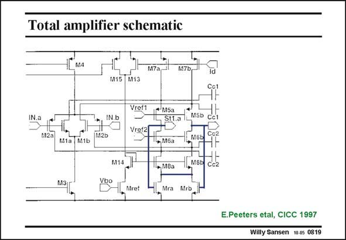

# SANSEN-0819 · Total amplifier schematic

章节：08 全差分放大器  
PDF 页：242；书本页：248；幻灯片编号：0819  
状态：unreviewed



## 对应教材讲解

### PDF 242 · 书本 248

A fully-differential rail-torail amplifier is shown in this slide. It consists of two folded cascodes in parallel. The CMFB amplifier is as before. Transistors Mra and Mrb are in the linear region and define the GBW . This CM is smaller than the GBW , DM which may be a disadvantage. This CMFB amplifier has the same advantage as before. The average output voltage is set by matching. However, the transistors Mra/Mrb are matched to transistors Mref. Its Gate voltage Vbo sets the average voltage of the outputs. The independent biasing is carried out by the transistors M3/M4 and M15. All currents are set by these sources.

## 公式／性能结论候选摘录

以下为规则截取的原文，尚未逐项判读。

- PDF 242: The independent biasing is carried out by the transistors M3/M4 and M15.

## 曲线结论候选摘录

以下为规则截取的原文，尚未逐项判读。

（未由规则找到；不代表原页没有此类内容。）

## 原文条件与近似候选摘录

以下为规则截取的原文，尚未逐项判读。

（未由规则找到；不代表原页没有此类内容。）

## 幻灯片 OCR（未校正）

```text
Total amplifier schematic
1Lмa
M15
M13
Vref1
N.a
IN.b
+ M5a
St1.a
MSb
Vref2
M.2a
M2b
M1a M1b
• Мба
M14
MSb
• 18a
Cc2
M3
Vbo
Mrb
E.Peeters etal, CICC 1997
Willy Sansen 10.0s 0819
```

数学上下标、分数及正负号以原图为准。电路图已保留；未核对的连接不输出成可仿真 netlist。
