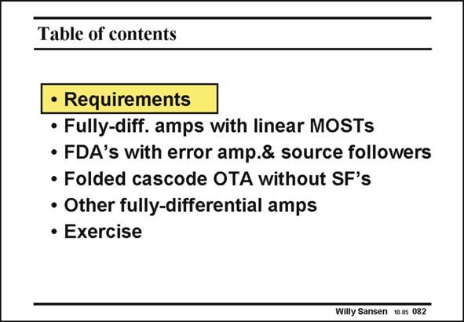

# SANSEN-082 · Table of contents

章节：08 全差分放大器  
PDF 页：233；书本页：239；幻灯片编号：082  
状态：unreviewed



## 对应教材讲解

### PDF 233 · 书本 239

Besides the power consumption, some other specifications may come in, which are typical for CMFB amplifiers. For example, the input range is an important characteristic. All requirements of CMFB amplifiers will be reviewed first. They are followed by a discussion of the three most important types of CMFB amplifiers. All of them have advantages and disadvantages. None of them provides an ideal solution. After this discussion, a number of practical realizations are examined. Their compromises are discussed. Finally, an exercise is launched to generate better insight. It includes the comparison of a CMOS with a BiCMOS solution.

## 公式／性能结论候选摘录

以下为规则截取的原文，尚未逐项判读。

（未由规则找到；不代表原页没有此类内容。）

## 曲线结论候选摘录

以下为规则截取的原文，尚未逐项判读。

- PDF 233: For example, the input range is an important characteristic.

## 原文条件与近似候选摘录

以下为规则截取的原文，尚未逐项判读。

（未由规则找到；不代表原页没有此类内容。）

## 幻灯片 OCR（未校正）

```text
Table of contents
• Requirements
• Fully-diff. amps with linear MOSTs
• FDA's with error amp.& source followers
• Folded cascode OTA without SF's
• Other fully-differential amps
• Exercise
Willy Sansen 10.0s 082
```

数学上下标、分数及正负号以原图为准。电路图已保留；未核对的连接不输出成可仿真 netlist。
